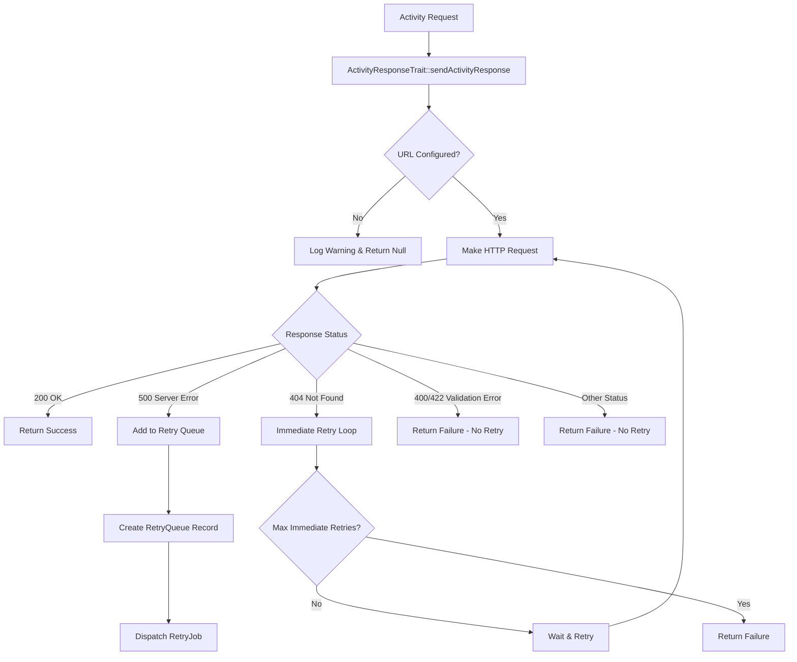

# Activity Response Retry Logic Documentation

## Overview

The Hibarr CRM system implements a sophisticated retry mechanism for handling failed activity responses (emails, WhatsApp, Instagram, Telegram, etc.). The retry system uses a combination of immediate retries, queued retries, and exponential backoff to ensure reliable delivery of activity responses.

## Architecture Components

### 1. Core Components

- **`ActivityResponseTrait`** - Main trait handling HTTP requests and retry logic
- **`ActivityResponseRetryJob`** - Laravel job for processing queued retries
- **`ActivityResponseRetryQueue`** - Eloquent model for database persistence
- **`ActivityResponseRetryCommand`** - Artisan command for queue management

### 2. Database Structure

The retry queue is stored in the `activity_response_retry_queue` table with the following structure:

```sql
CREATE TABLE activity_response_retry_queue (
    id BIGINT PRIMARY KEY,
    original_data JSON,           -- Original request data
    original_headers JSON,        -- Original HTTP headers
    channel VARCHAR(255),         -- Activity channel (email, whatsapp, etc.)
    status VARCHAR(255),          -- pending, processing, completed, failed
    attempts INT DEFAULT 0,       -- Number of retry attempts
    last_attempt_at TIMESTAMP,    -- Last attempt timestamp
    next_retry_at TIMESTAMP,      -- Next retry scheduled time
    completed_at TIMESTAMP,       -- Completion timestamp
    failed_at TIMESTAMP,          -- Failure timestamp
    last_response JSON,           -- Last response received
    error_message TEXT,           -- Error message if failed
    created_at TIMESTAMP,
    updated_at TIMESTAMP
);
```

## Retry Flow

### 1. Initial Request Processing



### 2. Immediate Retry Logic

For **404 Not Found** errors, the system performs immediate retries with exponential backoff:

- **Max Retries**: Configurable via `ACTIVITY_RETRY_MAX_RETRIES` (default: 10)
- **Base Delay**: Configurable via `ACTIVITY_RETRY_BASE_DELAY_SECONDS` (default: 60 seconds)
- **Backoff Strategy**: Exponential backoff (delay = base_delay * 2^attempt)
- **Max Delay**: Capped at `ACTIVITY_RETRY_MAX_DELAY_SECONDS` (default: 3600 seconds)

### 3. Queued Retry Logic

For **500 Server Error** responses, requests are added to the retry queue:

1. **Queue Addition**: Creates `ActivityResponseRetryQueue` record
2. **Job Dispatch**: Dispatches `ActivityResponseRetryJob` with delay
3. **Processing**: Job processes the retry attempt
4. **Success**: Marks as completed and removes from queue
5. **Failure**: Increments attempts and schedules next retry

## Configuration

### Environment Variables

```env
# Enable/disable retry queue
ACTIVITY_RETRY_QUEUE_ENABLED=true

# Maximum number of retries
ACTIVITY_RETRY_MAX_RETRIES=10

# Initial delay when adding to retry queue (seconds)
ACTIVITY_RETRY_INITIAL_DELAY_SECONDS=120  # 2 minutes initial delay

# Base delay between subsequent retries (seconds)
ACTIVITY_RETRY_BASE_DELAY_SECONDS=60

# Maximum delay between retries (seconds)
ACTIVITY_RETRY_MAX_DELAY_SECONDS=3600

# Job-level retry configuration
ACTIVITY_RETRY_JOB_MAX_RETRIES=3
ACTIVITY_RETRY_JOB_MAX_EXCEPTIONS=5
ACTIVITY_RETRY_JOB_TIMEOUT=300

# Cleanup configuration
ACTIVITY_RETRY_CLEANUP_AFTER_DAYS=30
```

### Configuration Structure

```php
'automations' => [
    'retry_queue' => [
        'enabled' => env('ACTIVITY_RETRY_QUEUE_ENABLED', true),
        'max_retries' => env('ACTIVITY_RETRY_MAX_RETRIES', 10),
        'initial_delay_seconds' => env('ACTIVITY_RETRY_INITIAL_DELAY_SECONDS', 120),
        'base_delay_seconds' => env('ACTIVITY_RETRY_BASE_DELAY_SECONDS', 60),
        'max_delay_seconds' => env('ACTIVITY_RETRY_MAX_DELAY_SECONDS', 3600),
        'max_job_retries' => env('ACTIVITY_RETRY_JOB_MAX_RETRIES', 3),
        'max_exceptions' => env('ACTIVITY_RETRY_JOB_MAX_EXCEPTIONS', 5),
        'job_timeout' => env('ACTIVITY_RETRY_JOB_TIMEOUT', 300),
        'job_backoff' => [30, 60, 120], // seconds
        'cleanup_after_days' => env('ACTIVITY_RETRY_CLEANUP_AFTER_DAYS', 30),
    ],
],
```

## Retry Strategies

### 1. HTTP Status Code Handling

| Status Code | Action | Retry Strategy |
|-------------|--------|----------------|
| 200 | Success | Return immediately |
| 400 | Validation Error | No retry - return failure |
| 404 | Not Found | Immediate retry with exponential backoff |
| 422 | Unprocessable Entity | No retry - return failure |
| 500 | Server Error | Add to retry queue |
| Other | Unexpected | No retry - return failure |

### 2. N8N Response Format Handling

The system also handles N8N-specific response formats:

```php
// N8N Response Format
{
    "valid": true/false,
    "statusCode": 200,
    "missingFields": [] // for validation errors
}
```

- **Valid + 200**: Success
- **Invalid + 400/422**: No retry (validation error)
- **Other combinations**: Fallback to HTTP status logic

### 3. Exponential Backoff Calculation

```php
$delay = $baseDelay * pow(2, $attempt - 1);
$delay = min($delay, $maxDelay);
```

**Example with default settings:**
- Attempt 1: 60 seconds
- Attempt 2: 120 seconds  
- Attempt 3: 240 seconds
- Attempt 4: 480 seconds
- Attempt 5: 960 seconds
- Attempt 6+: 3600 seconds (capped)

## Queue Management

### 1. Queue Statuses

- **`pending`**: Waiting to be processed
- **`processing`**: Currently being processed
- **`completed`**: Successfully processed
- **`failed`**: Exceeded max retries

### 2. Queue Scopes

```php
// Ready for retry
ActivityResponseRetryQueue::readyForRetry()

// Failed items
ActivityResponseRetryQueue::failed()

// Completed items
ActivityResponseRetryQueue::completed()

// Specific channel
ActivityResponseRetryQueue::forChannel('email')
```

### 3. Artisan Commands

```bash
# Process pending retry items
php artisan activity:retry-queue process --limit=50 --channel=email

# Show queue statistics
php artisan activity:retry-queue stats

# Cleanup old items
php artisan activity:retry-queue cleanup --days=30

# Retry failed items
php artisan activity:retry-queue retry-failed --limit=10
```

### 4. Automated Scheduling

The retry queue is automatically processed by Laravel's task scheduler:

- **Every 5 minutes**: Processes up to 50 pending retry items
- **Daily at 3:00 AM**: Cleans up old completed/failed items (older than 30 days)


## Error Handling

### 1. Exception Handling

- **Network Exceptions**: Caught and logged, status code set to 0
- **Job Failures**: Handled by Laravel's job failure mechanism
- **Database Errors**: Logged and handled gracefully

### 2. N8N Unreachable Notifications

When max retries are reached and N8N is determined to be unreachable, the system automatically adds a notification to the retry queue:

**Unreachable Detection Criteria:**
- Status codes: 0, 404, 500, 502, 503, 504
- Response messages containing: "webhook not registered", "connection refused", "timeout", "unreachable", "not found", "internal server error"
- No response received (null response)

**Notification Details:**
- Channel: `system_notification`
- Priority: `high`
- Retry after: 5 minutes
- Includes original retry queue ID, channel, and failure details

### 2. Logging

Comprehensive logging at each step:

```php
// Request logging
Log::info('Processing retry queue item', [
    'retry_queue_id' => $this->retryQueueId,
    'attempt' => $retryQueue->attempts + 1,
    'channel' => $this->originalData['channel'] ?? 'unknown'
]);

// Success logging
Log::info('Retry successful, removing from queue', [
    'retry_queue_id' => $this->retryQueueId,
    'status_code' => $response['status_code']
]);

// Failure logging
Log::error('Max retries reached, marking as failed', [
    'retry_queue_id' => $this->retryQueueId,
    'attempts' => $newAttempts
]);
```

## Channel-Specific Validation

The system includes validation for different communication channels:

### Email Channel
- Required fields: `email`, `subject`, `first_name`, `last_name`, `reply_to`, `message_type`, `sender_name`
- Email format validation
- Reply-to email validation

### WhatsApp Channel
- Required fields: `phone_number`, `first_name`, `last_name`
- Phone number format validation

### Instagram Channel
- Required fields: `instagram_username`, `instagram_page_id`, `first_name`, `last_name`
- Username format validation
- Page ID numeric validation

### Telegram Channel
- Required fields: `telegram_username`, `telegram_chat_id`, `first_name`, `last_name`
- Username format validation
- Chat ID format validation

## Monitoring and Maintenance

### 1. Queue Statistics

Monitor queue health using the stats command:

```bash
php artisan activity:retry-queue stats
```

Output includes:
- Total items by status
- Channel breakdown
- Recent activity
- Ready for retry count

### 2. Cleanup Strategy

Automated cleanup of old records:

- **Completed items**: Cleaned up after 30 days (configurable)
- **Failed items**: Cleaned up after 30 days (configurable)
- **Manual cleanup**: Available via artisan command

### 3. Performance Considerations

- **Database Indexes**: Optimized for common queries
- **Job Timeouts**: Configurable to prevent hanging jobs
- **Memory Management**: Jobs are stateless and lightweight
- **Queue Workers**: Can be scaled horizontally

## Best Practices

### 1. Configuration

- Set appropriate retry limits based on your infrastructure
- Monitor queue statistics regularly
- Adjust delays based on external service response times
- Enable cleanup to prevent database bloat

### 2. Monitoring

- Set up alerts for high failure rates
- Monitor queue size and processing times
- Track success rates by channel
- Monitor external service health

### 3. Troubleshooting

- Check logs for specific error patterns
- Verify external service availability
- Review queue statistics for bottlenecks
- Test retry logic with controlled failures

## Integration Points

### 1. Activity Response Handler

The retry system integrates with an external activity response handler (typically N8N):

- **URL Configuration**: Set via `ACTIVITY_RESPONSE_HANDLER_URL`
- **Authentication**: Headers can be customized per request
- **Response Format**: Supports both HTTP status codes and N8N format

### 2. Laravel Queue System

- **Queue Driver**: Uses configured Laravel queue driver
- **Job Processing**: Handled by Laravel queue workers
- **Failure Handling**: Integrated with Laravel's job failure system

### 3. Notification System

The system uses the project's built-in notification system rather than external toast notifications, as per user preference.

## Security Considerations

- **SSL Verification**: Disabled in development environments
- **Data Persistence**: Sensitive data stored in encrypted JSON fields
- **Access Control**: Queue management commands should be restricted
- **Logging**: Sensitive data should be excluded from logs

This retry system provides a robust, scalable solution for handling activity response failures while maintaining data integrity and providing comprehensive monitoring capabilities.
