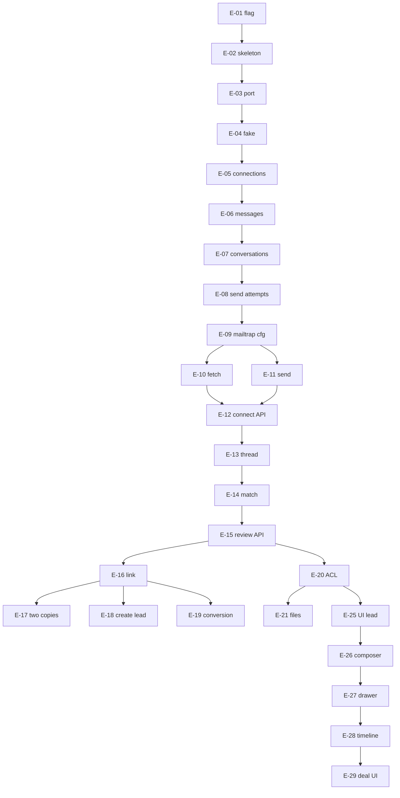

# CRM Email — implementation checklist

**Docs:** [README](./README.md) · [brief](./brief.md) · [architecture](./architecture.md) · [dependencies](./dependencies.md) · [access-matrix](./access-matrix.md)  
**PRD:** CRM-COM-EMAIL v0.2

Do **not** start E-01 until explicitly asked. One task per change-set unless the prompt says otherwise.

---

## How to run tasks

| Mode | Prompt |
|------|--------|
| **Implement** | `Implement task E-XX from docs/email/checklist.md. Read docs/email/architecture.md first. Flag crm.email; fail closed if off. New Email module only — do not use communication_activities, company SMTP, ticket IMAP, or Zoho calendar tokens. Mailbox copy is SOT. MailTransport port only. Done when the task acceptance checks pass. Do not start the next task.` |
| **Verify** | `Verify task E-XX from docs/email/checklist.md. Do not expand scope.` |

**Status:** `todo` · `doing` · `done` · `blocked (reason)`

**Default order:** E-01 → E-08, then E-09–E-12 (M1), E-13–E-19 (M2), **E-20 before any UI that shows bodies**, E-25–E-29 (M3), E-30–E-37 (M4), E-38–E-41 (Zoho), E-42–E-45 (policy).

**Milestones:** M1 = E-12 · M2 = E-19 · M3 = E-29 · M4 = E-37 · M5 = E-41 + policy.

---

## A. Scaffold

### Task E-01 — Feature flag

| | |
|--|--|
| **Goal** | `crm.email` is a known flag, off by default, testable. |
| **Depends on** | None |
| **Files** | `config/features.php`, `app/Support/FeatureFlags.php` or a small `App\Email` helper, tests under `tests/Feature/Email/` |

#### Impl

1. Add `'crm.email'` to `known_flags`.
2. Do **not** set it true in `local_defaults`.
3. Helper `EmailFeature::enabled()` wrapping `FeatureFlags::enabled('crm.email')`.
4. PHPUnit: flag off by default in tests; `SetsFeatureFlags` can turn it on.

#### Out of scope

Routes, UI, Mailtrap, registering the flag in the remote flags service (ops; note in PR).

#### Verify

- [x] `forInertia()` includes `crm.email`
- [x] Flag absent/false → helper false
- [x] Test override true → helper true

---

### Task E-02 — Module skeleton

| | |
|--|--|
| **Goal** | Empty `App\Email` (+ JS folder) and `config/email.php` exist; nothing callable in production. |

#### Impl

1. `app/Email/` PSR-4 (composer autoload if needed).
2. `config/email.php`: flag name, queue names `email-sync` / `email-send`, default provider `fake`.
3. `resources/js/Pages/Email/` or `resources/js/Email/` placeholder only if required; prefer no UI yet.
4. No public routes.

#### Out of scope

Port implementation, migrations.

#### Verify

- [x] `config('email.queues.sync')` etc. resolve
- [x] App boots; no new endpoints

---

### Task E-03 — Port and DTOs

| | |
|--|--|
| **Depends on** | E-02 |

#### Impl

1. `MailTransport` interface per [architecture.md](./architecture.md).
2. DTOs: `NormalizedMessage`, `SendResult`, `Checkpoint`, `FetchPage`, `Draft`.
3. Value objects for addresses; RFC ids as strings.

#### Out of scope

HTTP, Mailtrap SDK.

#### Verify

- [x] Interface compilable; DTOs have no Eloquent

---

### Task E-04 — Fake adapter

| | |
|--|--|
| **Depends on** | E-03 |

#### Impl

1. `FakeMailAdapter`: in-memory store per connection key.
2. Seed helpers: inbound, outbound, **same Message-ID on two connections**, send accept / reject / timeout / throttle.
3. Bind in `testing` (and local default).

#### Verify

- [x] Unit tests cover seed + fetch + send results without network

---

## B. Persistence

### Task E-05 — Connections and allowlist

| | |
|--|--|
| **Depends on** | E-01, E-02 |

#### Impl

1. Migrations: `email_connections`, `email_pilot_allowlist`.
2. Encrypted `credentials` cast; never plaintext IMAP-style.
3. Factories; company scope.

#### Out of scope

OAuth, UI.

#### Verify

- [x] Encrypt round-trip
- [x] Company isolation on the model

---

### Task E-06 — Messages and mailbox copies

| | |
|--|--|
| **Depends on** | E-05 |

#### Impl

1. `email_messages`, `email_mailbox_copies` as in architecture.
2. Unique (`connection_id`, `provider_message_id`); canonical dedupe on company + RFC Message-ID when present.
3. Service: `ingestNormalized(Connection, NormalizedMessage): Copy` idempotent.

#### Verify

- [x] Double ingest same provider id → one copy
- [x] Same RFC id, two connections → one message, two copies

---

### Task E-07 — Conversations and record links

| | |
|--|--|
| **Depends on** | E-06 |

#### Impl

1. `email_conversations`, `email_record_links`, `email_link_audits`.
2. Link/unlink APIs as domain methods (no HTTP yet if easier — HTTP in E-16).
3. Unlink: delete/disable links; copies remain.

#### Verify

- [ ] Unlink leaves copies; audit row written

---

### Task E-08 — Send attempts

| | |
|--|--|
| **Depends on** | E-05 |

#### Impl

1. `email_send_attempts`, `email_send_recipients`.
2. Statuses: `sending`, `sent`, `failed`, `checking`, `waiting_quota`. **No** `delivered`.
3. Retry uses the same attempt id.

#### Verify

- [ ] Accept → `sent` not `delivered`
- [ ] Second retry does not create a second attempt when reconciling unknown

---

## C. Mailtrap (M1)

### Task E-09 — Mailtrap config

| | |
|--|--|
| **Depends on** | E-03, E-05 |
| **Blocked on** | Token in env for **manual** verify only; tests must not need live Mailtrap |

#### Impl

1. Config/env keys per [dependencies.md](./dependencies.md).
2. `MailtrapAdapter` scaffolding: map connection credentials → API client.
3. Document two-sandbox mapping in `config/email.php` comments.

#### Verify

- [ ] Missing token → health = needs_reconnect, no exception leak

---

### Task E-10 — Mailtrap fetch + sync job

| | |
|--|--|
| **Depends on** | E-04, E-06, E-09 |

#### Impl

1. `fetchSince` → ingest.
2. Job on `email-sync`; skip if flag off, not allowlisted, or `stopped`.
3. Exclude empty/error inboxes cleanly; checkpoint persist.

#### Out of scope

Folder policy beyond what sandbox returns; bounce.

#### Verify

- [ ] Fake path: job ingests fixture
- [ ] Optional manual: one sandbox message → one copy locally
- [ ] Job no-ops when flag off

---

### Task E-11 — Mailtrap send

| | |
|--|--|
| **Depends on** | E-08, E-09 |

#### Impl

1. `send` via sandbox SMTP or API.
2. Persist attempt **before** call; map result.
3. Validation errors (missing To, etc.) do not call provider; draft retained (store draft JSON on attempt or a drafts table).

#### Verify

- [ ] Fake reject retains draft
- [ ] Accept does not set Delivered
- [ ] Optional manual: captured in sandbox

---

### Task E-12 — Connect / stop / reconnect API

| | |
|--|--|
| **Depends on** | E-10, E-11 |
| **Milestone** | **M1** |

#### Impl

1. Flagged routes: create connection (Mailtrap inbox + secrets), stop, resume, destroy/reconnect.
2. Allowlist + `auth` + `company`.
3. Stop: no new sync/send.

#### Verify

- [ ] Flag off → 404
- [ ] Non-allowlisted → 403
- [ ] Stopped connection: jobs skip
- [ ] Unauthenticated → 401

---

## D. Matching and review (M2)

### Task E-13 — Thread join

| | |
|--|--|
| **Depends on** | E-06, E-07 |

#### Impl

Join only on In-Reply-To / References / Message-ID. Subject match **must not** join.

#### Verify

- [ ] Reply with In-Reply-To joins
- [ ] Same subject, new Message-ID, no refs → not joined

---

### Task E-14 — Unique contact match

| | |
|--|--|
| **Depends on** | E-13 |
| **Files** | Lead/deal emails + `LeadContactMethod` (read only) |

#### Impl

Exactly one authorized address on a visible record → attach/create conversation on that record. Zero or many → review. Do not use comms `CommunicationActivityResolverService`.

#### Verify

- [ ] Unique lead email → linked
- [ ] Two leads same email → review
- [ ] Unknown → review

---

### Task E-15 — Private review API

| | |
|--|--|
| **Depends on** | E-14, E-20 can follow immediately after; until E-20, **owner-only** queries |

#### Impl

List/show unlinked copies for `auth` mailbox owner only. Access conflict: message + `record_exists: true` without lead payload.

#### Verify

- [ ] Other user IDOR 403/404
- [ ] Owner sees sender, To/Cc, subject, time, safe preview

---

### Task E-16 — Link / unlink / dismiss

| | |
|--|--|
| **Depends on** | E-15, E-07 |

#### Impl

Explicit actions + audit. Dismiss: not provider delete. Unlink: projections gone, copies stay. Linking a thread brings that mailbox’s earlier messages **in order**.

#### Verify

- [ ] Link then unlink: record feed empty, copy remains
- [ ] Dismiss does not call adapter delete

---

### Task E-17 — Two copies, one record event

| | |
|--|--|
| **Depends on** | E-16, E-04 |

#### Impl

Ingest same RFC Message-ID on two connections; link both to one record; Timeline/history API returns **one** message event; copies and unread stay per user.

#### Verify

- [ ] Fixture test as above
- [ ] Headers still show both To/Cc participants

---

### Task E-18 — Create lead from review

| | |
|--|--|
| **Depends on** | E-16 |
| **Reuse** | `LeadDuplicateDetectionService` **call only** |

#### Impl

Create lead with email as source; link conversation. Duplicate → reject second create, reconciliation path, **neither copy lost**.

#### Out of scope

Merge UI redesign.

#### Verify

- [ ] Duplicate email: second create fails; both copies intact

---

### Task E-19 — Lead-to-deal visibility

| | |
|--|--|
| **Depends on** | E-16 |
| **Milestone** | **M2** |

#### Impl

Linked conversation remains queryable from the deal via the lead without duplicating message rows.

#### Verify

- [ ] After deal created with `lead_id`, deal email feed lists the conversation once

---

## E. ACL, files, search

### Task E-20 — EmailAccess

| | |
|--|--|
| **Depends on** | E-15 |
| **Doc** | [access-matrix.md](./access-matrix.md) |

#### Impl

Central checker; middleware/policies on all email HTTP. Partner Lead Owner **N**. TBD cells **N**. Tests for mailbox owner, other agent, partner, unlink.

#### Verify

- [ ] Matrix Y/N cases as automated tests
- [ ] Search/export/file routes use the same checker

---

### Task E-21 — Email files

| | |
|--|--|
| **Depends on** | E-06, E-20 |

#### Impl

`email_files`; upload prefix `email-attachments/`; not `LeadFile`. Stub size/type; scan_status `pending`/`unavailable` until E-43. Failed **outbound** file blocks whole send.

#### Verify

- [ ] Download without access 403
- [ ] Not listed on CRM Files tab

---

### Task E-22 — HTML sanitize

| | |
|--|--|
| **Depends on** | E-06 |

#### Impl

Store raw + safe HTML + text. Strip/block remote resources by default. Charset: decode declared; keep original on failure.

#### Verify

- [ ] Script/onerror stripped
- [ ] Remote `img` not loaded in safe HTML

---

### Task E-23 — Search

| | |
|--|--|
| **Depends on** | E-20 |

#### Impl

Record search: participants, subject, body, filename. Review search: owner only.

#### Verify

- [ ] Unauthorized snippet absent
- [ ] Review query cannot see another user’s unlinked body

---

### Task E-24 — Per-user unread

| | |
|--|--|
| **Depends on** | E-06 |

#### Impl

`email_user_reads`. Open exact message → that user only. Not provider \Seen. Reassignment does not resurrect unread.

#### Verify

- [ ] Two users, one open: other still unread
- [ ] Duplicate sync does not duplicate unread

---

## F. UI (M3)

All UI: flag + connection (or review-only for E-30). `t()` lang keys + bump `I18N_DICT_VERSION` when adding keys. Shared Redesign primitives.

### Task E-25 — Lead Quick action Email

| | |
|--|--|
| **Depends on** | E-01, E-12 |
| **Files** | `DossierQuickActions.tsx`, `LeadViewRedesign.tsx` |

#### Impl

Email action visible iff flag + allowlist + (connection or connect CTA). Opens composer entry.

#### Verify

- [ ] Flag off: no Email action
- [ ] Keyboard accessible control

---

### Task E-26 — Composer

| | |
|--|--|
| **Depends on** | E-11, E-25, E-21 |

#### Impl

New + reply; To/Cc, subject, body, multi-attach, signature preview/once; From/Reply-To from connection; prefill lead email. No Bcc field. Block send on invalid file. Draft retain on fail.

#### Verify

- [ ] Fake/Mailtrap accept shows Sent not Delivered
- [ ] Missing To kept as draft

---

### Task E-27 — Record email drawer

| | |
|--|--|
| **Depends on** | E-20, E-16, E-21 |

#### Impl

Conversation + exchanged attachments; deep link to exact message; header From/To/Cc/date/subject/files/receiving mailbox. Bcc only if this account knows it.

#### Verify

- [ ] Oldest and newest visible
- [ ] File deep-links to message

---

### Task E-28 — Timeline group

| | |
|--|--|
| **Depends on** | E-27 |
| **Files** | Deal/Lead redesign timeline |

#### Impl

Compact group per conversation (latest, count, status); expand dated messages. **No** extra generic activity row for the same email. Delivery failures distinct.

#### Out of scope

Emitting unused catalog slugs as duplicates.

#### Verify

- [ ] One group per conversation
- [ ] Click opens that message

---

### Task E-29 — Deal Email UI

| | |
|--|--|
| **Depends on** | E-25–E-28 |
| **Milestone** | **M3** |

#### Impl

Equivalent Quick action / composer / drawer / Timeline on deal redesign.

#### Verify

- [ ] Same flag gates
- [ ] Conversion visibility from E-19

---

## G. Review UX, follow-ups, ops (M4)

### Task E-30 — Review queue page

| | |
|--|--|
| **Depends on** | E-15, E-16, E-18 |

#### Impl

Inertia page: create / attach / dismiss. Safe preview.

#### Verify

- [ ] Direct URL other user’s item 403/404

---

### Task E-31 — Handoff / escalate

| | |
|--|--|
| **Depends on** | E-30, E-20 |

#### Impl

Explicit + audit. No silent `lead_owner` change. Recipient must have access to accept. Pending remains visible.

#### Verify

- [ ] Owner unchanged on handoff
- [ ] Reject leaves copy with sender

---

### Task E-32 — Linked task / meeting / note

| | |
|--|--|
| **Depends on** | E-27 |

#### Impl

Create existing task/meeting/note with `source_email_message_id` (or equivalent). Email send/receive does **not** complete tasks or change stage.

#### Verify

- [ ] Inbound does not create a task by default
- [ ] Follow-up opens source message

---

### Task E-33 — Connection settings UI

| | |
|--|--|
| **Depends on** | E-12 |

#### Impl

Mailtrap connect form (dev/staging), status, stop, reconnect, waiting-to-send copy.

#### Verify

- [ ] Stop from UI halts jobs

---

### Task E-34 — New-mail indicator

| | |
|--|--|
| **Depends on** | E-24 |

#### Impl

In-app indicator for **mailbox owner** even if they are not Lead Owner. Two recipients: both indicated; neither sole responder.

#### Out of scope

Emailing the agent a copy of customer mail (privacy).

#### Verify

- [ ] Lead reassignment does not mark old mail unread for new owner

---

### Task E-35 — Manager work report

| | |
|--|--|
| **Depends on** | E-30, E-31, E-08 |

#### Impl

Counts only: pending unlinked routing, open follow-ups linked to email, unresolved handoffs, delivery/sync faults. Age, accountable mailbox, link to item. No body scoring. Reading ≠ handled.

#### Verify

- [ ] Informational inbound creates no overdue
- [ ] Counts match queues

---

### Task E-36 — Mailbox stop control

| | |
|--|--|
| **Depends on** | E-12, E-33 |
| **Milestone** | part of **M4** |

#### Impl

Already in E-12; ensure UI + support path; preserve history.

#### Verify

- [ ] Stop: no send, no sync, copies readable by owner

---

### Task E-37 — Observability

| | |
|--|--|
| **Depends on** | E-10, E-11 |
| **Milestone** | **M4** |

#### Impl

Structured logs: connection, send, link, unlink, permission denies — **no** full content. Job metrics. Do not promote 2-minute p95 to SLO.

#### Verify

- [ ] Sample log line has no body/token

---

## H. Zoho (M5 transport)

### Task E-38 — Zoho OAuth adapter

| | |
|--|--|
| **Depends on** | E-03, E-12, CTO client |
| **Blocked on** | [dependencies.md](./dependencies.md) Zoho items |

Same port. Per-user tokens. Do not use `config/zoho.php` refresh token.

---

### Task E-39 — Provider spike matrix

Folders, other-client Sent, signatures, DSN, quotas, reconnect, duplicate delivery, checkpoint reset. Record actual limits. Choose API / IMAP / hybrid **inside** the Zoho adapter.

---

### Task E-40 — Bounce hold

Only if E-39 attribution is reliable. Per-recipient hold until ops/manager review. Temporary delay ≠ bounce.

---

### Task E-41 — Staging cutover

| | |
|--|--|
| **Milestone** | **M5** transport |

Default adapter Zoho in staging for allowlisted users. Mailtrap remains for local/CI. Fake remains for PHPUnit.

---

## I. Policy-gated (do not implement until signed)

### Task E-42 — Retention

Approved schedule; linked mail, unlinked review, attachments, audit, holds, backups. No pilot PII before sign-off.

### Task E-43 — Malware

Approved scanner; fail-closed unless security signs otherwise.

### Task E-44 — Successor / manager policy

Implement access-matrix TBD cells **after** Founder/PM/ops sign. Until then keep deny.

### Task E-45 — Pilot instrumentation

Named mailboxes, support owner, volume, absence cover. Baseline five compose/reply/attachment tasks; record tab switches, missed/dupes, time-to-find.

---

## Regression (use on Verify of UI tasks)

- [ ] Flag off: no Email Quick action, no `/email` routes
- [ ] Allowlist off: no connect
- [ ] Partner Lead Owner: no communications
- [ ] Two-sandbox Message-ID fixture: one record event
- [ ] Unlink: gone from Timeline, still in owner mailbox
- [ ] Legacy communication-activity SMTP still untouched
