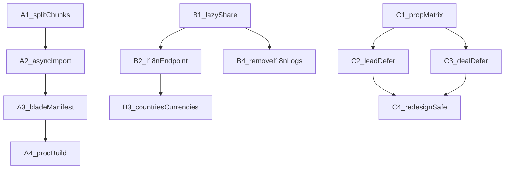

# Inertia React Performance — Implementation Checklist (P0 + P1)

**Overview:** [inertia-react-performance-overview.md](./inertia-react-performance-overview.md)

**Related (Index-only):** [leads-deals-index-performance-checklist.md](./leads-deals-index-performance-checklist.md)

Use this checklist to implement work in small, promptable tasks. Each task separates **Impl** from **Verify** so you can ship code first and test later.

---

## How to run tasks

Copy one of these prompt styles into chat:

| Mode | Prompt pattern |
|------|----------------|
| **Impl only** | `Implement Task {ID} (impl only). Follow docs/inertia-react-performance-checklist.md. Do not run verify steps or write tests unless asked.` |
| **Verify only** | `Verify Task {ID}. Follow the Verify section in docs/inertia-react-performance-checklist.md. Do not change production code unless fixing a verify failure.` |
| **Both** | `Implement + Verify Task {ID}. Follow docs/inertia-react-performance-checklist.md.` |

**Impl-only definition of done:** code changes match Impl steps; production Mix build succeeds (`npm run production` or the task’s stated build); Verify bullets remain unchecked.

**Recommended order:** A1 → A2 → A3 → A4 → B1 → B2 → B3 → B4 → C1 → C2 → C3 → C4.



Phase A is independent of B/C for server work, but cold-load wins need A first. Phase C needs C1 before C2–C4.

---

## Phase A — Mix code splitting

### Task A1 — Enable Webpack `splitChunks`

| | |
|--|--|
| **Goal** | Configure Mix/Webpack to emit vendor/common chunks instead of one monolithic graph dependency dump (prep for async pages). |
| **Depends on** | None |
| **Files** | [`webpack.mix.js`](../webpack.mix.js) |

#### Impl

1. In `webpack.mix.js`, extend the existing `.webpackConfig({ ... })` with Webpack optimization, for example:
   - `optimization.splitChunks.chunks: 'all'`
   - Cache groups for `vendor` (`/[\\/]node_modules[\\/]/`) and optionally `antd` / `react` if you want finer caching
   - Keep the `inertia` entry: `.ts("resources/js/inertia.tsx", "public/js")`
2. Ensure Mix still writes `public/mix-manifest.json` entries for new chunks.
3. Do **not** change `inertia.tsx` page resolve in this task (that is A2).
4. Run a production build and confirm multiple JS files appear under `public/js/` (or Mix’s configured output). Document observed filenames in a short comment or PR note if helpful — do not invent a new bundler.

#### Out of scope

- Async `import()` for pages (A2)
- Blade script tag changes beyond what is required for the build to succeed (A3)
- Disabling source maps (A4)

#### Verify (later)

- [ ] `npm run production` completes without Webpack errors
- [ ] `public/mix-manifest.json` lists more than one JS asset related to inertia/vendors
- [ ] No accidental deletion of `main.js` / `bootstrap.js` Mix pipeline

#### Prompt

```text
Implement Task A1 (impl only). Follow docs/inertia-react-performance-checklist.md.
Do not run verify steps or write tests unless asked.
```

---

### Task A2 — Async page `import()` in Inertia resolve

| | |
|--|--|
| **Goal** | Stop sync `require()` of every page so Webpack can emit per-page chunks. |
| **Depends on** | A1 recommended (can proceed alone, but chunks won’t split cleanly without A1) |
| **Files** | [`resources/js/inertia.tsx`](../resources/js/inertia.tsx) |

#### Impl

1. Replace the sync resolver:

   ```ts
   const component = require(`./Pages/${name}`).default;
   ```

   with an async dynamic import pattern compatible with Inertia, e.g.:

   ```ts
   resolve: (name) => {
     const pages = require.context("./Pages", true, /\.tsx$/);
     // OR prefer: import(`./Pages/${name}`) returning a Promise
     // Keep InnerProviders layout wrapping behavior that exists today.
   }
   ```

   Prefer **`import(\`./Pages/${name}\`)`** (or `import(\`./Pages/${name}.tsx\`)` as needed by the resolver) returning a Promise of the module, then attach `.default` and preserve the existing `component.layout` wrap with `InnerProviders`.

2. Ensure TypeScript still compiles (Inertia accepts `Promise` from `resolve`).
3. Keep `initI18n` bootstrap behavior unchanged in this task.
4. Remove or avoid re-introducing the commented Vite `import.meta.glob` block unless you are only using it as reference — production remains Mix.

#### Out of scope

- Blade / manifest wiring (A3)
- i18n endpoint (B2)

#### Verify (later)

- [ ] Cold load of an Inertia page fetches a page-specific chunk (Network tab), not only one giant file containing all pages
- [ ] Navigating to a second Inertia page loads an additional chunk
- [ ] Layout providers still wrap pages (no missing TranslationProvider / Antd)

#### Prompt

```text
Implement Task A2 (impl only). Follow docs/inertia-react-performance-checklist.md.
Do not run verify steps or write tests unless asked.
```

---

### Task A3 — Blade + Mix manifest load split chunks

| | |
|--|--|
| **Goal** | Ensure the browser loads runtime/vendor/entry chunks correctly from Mix. |
| **Depends on** | A1, A2 |
| **Files** | [`resources/views/layouts/inertia_alt.blade.php`](../resources/views/layouts/inertia_alt.blade.php), possibly [`webpack.mix.js`](../webpack.mix.js) if `publicPath` / runtime chunk needs Mix helpers |

#### Impl

1. Inspect post-build `public/mix-manifest.json` after A1+A2.
2. Update `inertia_alt` so scripts load correctly:
   - Prefer Mix’s documented pattern for code splitting (e.g. ensure the **entry** `mix('js/inertia.js')` pulls dependencies, or include Mix-generated runtime if required by your Mix version).
   - Fix any `publicPath` so chunk requests resolve under `/js/...` (or the path Mix emits).
3. Remove production debug noise in the same layout file if still present (e.g. `console.log('✅ app.blade.php loaded')` and DOMContentLoaded debug script) — only this adjacent cleanup.
4. Do **not** switch `$rootView` to Vite layouts.

#### Out of scope

- CDN polyfill removal (P2)
- `@routes` / Ziggy trimming (P2)

#### Verify (later)

- [ ] Hard refresh Inertia page: no 404s for `*.js` chunks
- [ ] React mounts into `#app`
- [ ] Mix versioning (`?id=`) still works if used

#### Prompt

```text
Implement Task A3 (impl only). Follow docs/inertia-react-performance-checklist.md.
Do not run verify steps or write tests unless asked.
```

---

### Task A4 — Production build recipe (source maps off)

| | |
|--|--|
| **Goal** | Document and apply production-friendly Mix settings so deploys don’t ship huge maps. |
| **Depends on** | A1 |
| **Files** | [`webpack.mix.js`](../webpack.mix.js), optionally [`package.json`](../package.json) scripts comment / README note in this checklist only if a script change is required |

#### Impl

1. Change `.sourceMaps(true, "source-map")` so production builds do **not** emit large `.map` files by default (e.g. `mix.inProduction() ? false : …` or Mix’s recommended conditional).
2. Confirm `npm run production` still builds inertia entry + chunks.
3. Add a short “Build” note at the bottom of this task in the PR description (no new markdown file required): command to run, expected output dir.

#### Out of scope

- CI pipeline redesign
- Vite `v-build` migration

#### Verify (later)

- [ ] Production build does not publish a multi‑MB `inertia.js.map` next to the bundle (or maps are not publicly required)
- [ ] Staging/prod deploy docs (if any) still use `npm run production`

#### Prompt

```text
Implement Task A4 (impl only). Follow docs/inertia-react-performance-checklist.md.
Do not run verify steps or write tests unless asked.
```

---

## Phase B — Shared props slim

### Task B1 — Lazy shared closures + drop duplicate sidebar permissions

| | |
|--|--|
| **Goal** | Avoid eager evaluation of heavy shared values; remove duplicated permission payload. |
| **Depends on** | None (can parallel Phase A) |
| **Files** | [`app/Http/Middleware/HandleInertiaRequests.php`](../app/Http/Middleware/HandleInertiaRequests.php), any sidebar consumer of `sidebar.permissions` |

#### Impl

1. In `share()`, wrap eagerly evaluated heavy keys in closures where Inertia supports lazy evaluation, especially:
   - `company`
   - `appTheme`
   - any other non-closure DB-backed values that are safe to lazy-load
2. Remove `sidebar.permissions` duplication — sidebar should use `auth.permissions` (or a single shared key). Update frontend sidebar/nav components that read `sidebar.permissions` to use the remaining source.
3. Keep `auth.permissions` behavior intact for this task (caching improvements optional; do not expand scope into a full permission system rewrite).
4. Leave `translations` / `countries` / `currencies` for B2/B3.

#### Out of scope

- Translations endpoint (B2)
- Removing countries/currencies (B3)
- i18n debug log removal (B4) — may be same file but keep as separate commit/task if possible

#### Verify (later)

- [ ] Inertia partial reload still receives needed auth/company props when requested
- [ ] Sidebar/module visibility unchanged for a typical agent and admin
- [ ] Response JSON no longer contains two full permission maps

#### Prompt

```text
Implement Task B1 (impl only). Follow docs/inertia-react-performance-checklist.md.
Do not run verify steps or write tests unless asked.
```

---

### Task B2 — Translations via dedicated JSON endpoint

| | |
|--|--|
| **Goal** | Stop embedding full translation dictionaries in every Inertia response. Follow the locked approach in the overview §4.2. |
| **Depends on** | B1 recommended |
| **Files** | [`HandleInertiaRequests.php`](../app/Http/Middleware/HandleInertiaRequests.php), new controller/route for i18n JSON, [`resources/js/lib/i18n.ts`](../resources/js/lib/i18n.ts), [`resources/js/inertia.tsx`](../resources/js/inertia.tsx), [`resources/js/contexts/TranslationContext.tsx`](../resources/js/contexts/TranslationContext.tsx), [`resources/js/Types/inertia.d.ts`](../resources/js/Types/inertia.d.ts), routes file |

#### Impl

1. **Server:** Add route + controller/action that returns JSON `{ locale, translations, fallbackTranslations? }` using the existing flatten/cache logic from `getTranslations()` / `getFallbackTranslations()` (extract private methods to a dedicated service if that keeps middleware thin).
2. Remove `translations` and `fallbackTranslations` from Inertia `share()`. Keep `locale`, `isRtl`, `availableLocales`.
3. **Client:** On app boot, fetch the endpoint for `locale` before or while mounting; call `initI18n`. Update `TranslationContext` to stop reading dictionaries from `usePage().props` (may still sync locale changes and refetch on `changeLanguage`).
4. Handle locale switch: after locale updates (existing reload flow), ensure dictionaries refresh.
5. Apply HTTP caching headers appropriate for authenticated CRM (at minimum reuse Laravel `Cache::remember` server-side).
6. Remove debug `console.log(translations, …)` from `TranslationContext` if still present.

#### Out of scope

- Translating new copy
- Moving to a third-party i18n CDN

#### Verify (later)

- [ ] Inertia document/XHR props omit `translations` / `fallbackTranslations`
- [ ] UI strings still resolve for `en` and one non-`en` locale
- [ ] Language switcher still works
- [ ] Network shows i18n JSON fetched (and ideally cached on repeat navigations)

#### Prompt

```text
Implement Task B2 (impl only). Follow docs/inertia-react-performance-checklist.md.
Do not run verify steps or write tests unless asked.
```

---

### Task B3 — Move `countries` / `currencies` off global share

| | |
|--|--|
| **Goal** | Stop sending full country and currency lists on every Inertia page. |
| **Depends on** | B1 |
| **Files** | [`HandleInertiaRequests.php`](../app/Http/Middleware/HandleInertiaRequests.php), consumers under `resources/js` that use `props.countries` / `props.currencies`, relevant controllers that already pass form data (Leads/Deals/Clients/Properties), [`resources/js/Types/inertia.d.ts`](../resources/js/Types/inertia.d.ts) |

#### Impl

1. Remove `countries` and `currencies` from `share()`.
2. Inventory call sites (grep `countries` / `currencies` on page props). For each:
   - Prefer passing from the controller that already builds form data, **or**
   - Introduce a small reference endpoint + client cache (React Query) if many pages need them without controller changes.
3. Keep `default_currency_symbol` / `default_currency_code` in share if still cheap and widely used; otherwise document the alternative in the PR.
4. Update TypeScript shared prop types accordingly.

#### Out of scope

- Redesigning currency conversion logic
- Changing country DB schema

#### Verify (later)

- [ ] Lead/Deal/Client forms that need country dropdowns still populate
- [ ] Currency displays/editors still resolve symbols/codes
- [ ] Global Inertia payload no longer includes full `countries` / `currencies` arrays

#### Prompt

```text
Implement Task B3 (impl only). Follow docs/inertia-react-performance-checklist.md.
Do not run verify steps or write tests unless asked.
```

---

### Task B4 — Remove hot-path i18n debug logging

| | |
|--|--|
| **Goal** | Stop writing i18n debug logs on every Inertia request. |
| **Depends on** | None (same file as B1/B2; do after or with B2 to reduce merge conflict) |
| **Files** | [`app/Http/Middleware/HandleInertiaRequests.php`](../app/Http/Middleware/HandleInertiaRequests.php) |

#### Impl

1. Remove `\Log::channel('daily')->debug(...)` (and related verbose `info` logs in the translation build path that fire on cache hits / every request) from:
   - `getCurrentLocale()`
   - `getTranslations()`
   - locale file check loops
2. Keep a single `info`/`warning` on hard failures if useful; prefer silence on the happy path.
3. Do not change translation merge behavior.

#### Out of scope

- Log channel configuration
- New metrics/APM instrumentation

#### Verify (later)

- [ ] Hitting an Inertia page does not append i18n debug spam to `storage/logs/laravel-*.log`
- [ ] Locale resolution still correct for user preference vs session

#### Prompt

```text
Implement Task B4 (impl only). Follow docs/inertia-react-performance-checklist.md.
Do not run verify steps or write tests unless asked.
```

---

## Phase C — Defer Lead/Deal Show tab data

### Task C1 — Prop matrix: shell vs deferred (Lead + Deal)

| | |
|--|--|
| **Goal** | Lock the list of first-paint vs deferred props before coding controllers/UI. |
| **Depends on** | None (docs/decision only; update this checklist section or a short table in the PR) |
| **Files** | This checklist (update the matrices below), optionally a brief comment block in controllers pointing to the matrix — no behavior change required if the matrix is written here |

#### Impl

1. Fill and commit the matrices below based on current [`LeadContactController@show`](../app/Http/Controllers/LeadContactController.php), [`DealController@show`](../app/Http/Controllers/DealController.php), and redesign above-the-fold needs.
2. **Locked matrices (C1 — 2026-07-13):** every Show prop is classified. C2/C3 must follow these lists. Redesign overview note/task/meeting columns **skeleton** until deferred props arrive (C4); do not keep those collections on the shell.

**Exceptions / notes:**

- Redesign overview (`useLeadOverview` / `useWorkspaceOverview`) and context rail preview lists need `notes` / `tasks` / `leadFollowUps`|`dealFollowUps`, but first paint must not wait on them — **defer** and skeleton (C4).
- Keep `deals` + `meetingTypes` on Lead shell: schedule-meeting quick action and deal counts in chrome/rail.
- Keep `meetingTypes` on Deal shell for the same quick-action reason.
- `featureFlags` comes from Inertia **share**, not Show props (still available on first paint).
- Lead Show merges `getLeadFormData()` + remapped `getDealFormData()`; Deal Show merges `getDealFormData()`. Duplicate keys from that merge are listed once.

---

##### Lead Show — shell (first response)

| Prop | Why shell |
|------|-----------|
| `lead` | Entity chrome / info / qualification |
| `fields` / `customFields` | Info panel custom fields (filtered via `LeadCoreFieldsService`) |
| `customFieldCategories` | Info panel grouping |
| `categories`, `sources`, `employees` | Lead info edit (owner/source/category) |
| `countries`, `salutations`, `ageRanges`, `languages`, `clientCategories` | Lead edit / convert forms above the fold |
| `editLeadPermission`, `deleteLeadPermission` | Header actions |
| `dealPermissions`, `notePermissions`, `taskPermissions`, `followUpPermissions`, `qualificationPermissions` | Tab chrome / gates (cheap scalars) |
| `deals` | Header/summary + schedule-meeting deal picker + rail deal count |
| `meetingTypes` | Quick schedule meeting |
| `leadAiSummary` | Cached/cheap when flag on; `null` when flag off |
| `pageTitle` / route title derived from lead | Already on entity; no separate heavy prop |

##### Lead Show — defer

| Prop | Why defer |
|------|-----------|
| `notes` | Notes tab + overview notes column (skeleton) |
| `tasks` | Tasks tab + overview/rail (skeleton) |
| `leadFollowUps` | Meetings tab + overview/rail (skeleton) |
| `taskCategories`, `taskLabels`, `taskBoardColumns`, `projects` | Task create/edit modal only |
| `leadPipelines`, `leadStages`, `stages` | Deal create from Lead Show |
| `leadAgents`, `nonActiveLeadAgents`, `leadContacts` | Deal create / agent pickers not needed for first paint |
| `products`, `packages` | Deal create / attach flows |
| `dealCustomFields`, `dealCustomFieldCategories`, `pipelineCustomFieldCategoryIdsByPipeline` | Deal create custom fields from Lead Show |
| `dealCustomFields` (explicit Show key from `Deal` field defs) | Same — deal create only |

---

##### Deal Show — shell (first response)

| Prop | Why shell |
|------|-----------|
| `deal` (incl. `custom_fields_data`, relations already loaded for info) | Entity chrome / info |
| `productNames` | Header/summary |
| `fields` / `customFields`, `customFieldCategories` | Info panel |
| `permissions` | Tab chrome / actions |
| `pageTitle` | Document title |
| `meetingTypes` | Quick schedule meeting |
| `dealAiSummary` | Cached/cheap when flag on; `null` when flag off |
| `leadPipelines`, `stages`, `categories`, `sources` | Inline deal info edit |
| `countries`, `salutations` | Contact/info edit |
| `leadAgents` | Agent assignment on info (not full `employees`) |
| `products`, `packages` | Deal products/packages on info |

##### Deal Show — defer

| Prop | Why defer |
|------|-----------|
| `notes` | Notes tab + overview notes column (skeleton) |
| `dealFollowUps` | Meetings tab + overview (skeleton) |
| `files` | Files tab |
| `proposals` | Proposals tab |
| `histories` | History tab / activity bulk |
| `activities` | Communication activities bulk |
| `consents`, `gdprSetting` | GDPR/consent tab-only |
| `tasks` | Tasks tab + overview (skeleton) |
| `taskCategories`, `taskLabels`, `taskBoardColumns` | Task modal metadata |
| `employees` | `User::allEmployees()` — heavy; task modal / forms |
| `projects` | Task modal |
| `leadContacts`, `nonActiveLeadAgents` | Form helpers not needed for first paint |
| `pipelineCustomFieldCategoryIdsByPipeline` | Create/edit form helper; pipeline categories already on shell via `customFieldCategories` |

3. Controllers may add a one-line pointer comment to this matrix; **no behavior change in C1**.

#### Out of scope

- Controller defer implementation (C2/C3)
- UI loading states (C4)

#### Verify (later)

- [ ] Matrix reviewed against redesign overview columns (notes/tasks/meetings)
- [ ] No prop left unspecified (every current Show prop is shell or deferred)

#### Prompt

```text
Implement Task C1 (impl only). Follow docs/inertia-react-performance-checklist.md.
Do not run verify steps or write tests unless asked.
```

---

### Task C2 — Lead Show deferred props + tab loading

| | |
|--|--|
| **Goal** | Implement Inertia deferred props for Lead Show per C1 matrix. |
| **Depends on** | C1 |
| **Files** | [`app/Http/Controllers/LeadContactController.php`](../app/Http/Controllers/LeadContactController.php), [`resources/js/Pages/Leads/Show.tsx`](../resources/js/Pages/Leads/Show.tsx), [`LegacyLeadShow.tsx`](../resources/js/Pages/Leads/LegacyLeadShow.tsx), tab components under `Pages/Leads`, types in [`resources/js/Types`](../resources/js/Types) |

#### Impl

1. In `show`, wrap deferred prop values with `Inertia::defer(fn () => …)` (or project-standard defer helper) per C1.
2. Ensure deferred closures do not run heavy queries on the initial response.
3. Frontend: use Inertia deferred prop patterns / `router.reload({ only: [...] })` already used in redesign hooks so tabs wait for data.
4. Default missing deferred props to safe empties (`[]` / `null`) so legacy tabs don’t throw.
5. Do not change Deal Show here (C3).

#### Out of scope

- Redesign-only polish beyond crash-safety (C4)
- Shared prop work (Phase B)

#### Verify (later)

- [ ] Initial Lead Show HTML/JSON omits or marks deferred keys as pending
- [ ] Opening Notes/Tasks/Follow-ups loads data without full page error
- [ ] Partial reloads (`only: ['notes']`, etc.) still work

#### Prompt

```text
Implement Task C2 (impl only). Follow docs/inertia-react-performance-checklist.md.
Do not run verify steps or write tests unless asked.
```

---

### Task C3 — Deal Show deferred props + tab loading

| | |
|--|--|
| **Goal** | Same as C2 for Deal Show. |
| **Depends on** | C1 |
| **Files** | [`app/Http/Controllers/DealController.php`](../app/Http/Controllers/DealController.php), [`resources/js/Pages/Deals/Show.tsx`](../resources/js/Pages/Deals/Show.tsx), Deal tab components, Redesign under `Pages/Deals/Redesign` as needed for data access |

#### Impl

1. Apply C1 Deal matrix with `Inertia::defer` in `DealController@show`.
2. Especially defer `User::allEmployees()`, `Project::all()`, and tab collections (notes/files/proposals/histories/tasks metadata).
3. Mirror frontend safety defaults and reload-only patterns used on Lead.
4. Keep create/index deal endpoints unchanged unless they share helpers that must accept lazy evaluation.

#### Out of scope

- Lead Show (C2)
- Board / Index deal list performance

#### Verify (later)

- [ ] Initial Deal Show payload smaller vs baseline (notes/files/proposals not fully embedded up front)
- [ ] Tabs and redesign workspace panels populate after defer
- [ ] `router.reload({ only: ['proposals'] })` (and siblings) still work

#### Prompt

```text
Implement Task C3 (impl only). Follow docs/inertia-react-performance-checklist.md.
Do not run verify steps or write tests unless asked.
```

---

### Task C4 — Redesign views safe with deferred props

| | |
|--|--|
| **Goal** | Ensure Lead/Deal redesign UIs handle pending/empty deferred props without crashing or blanking the shell. |
| **Depends on** | C2, C3 |
| **Files** | [`LeadViewRedesign`](../resources/js/Pages/Leads/Redesign), [`DealViewRedesign`](../resources/js/Pages/Deals/Redesign), overview columns (notes/tasks/meetings), types |

#### Impl

1. Audit redesign components that assume arrays/objects always present (`notes.map`, `tasks.length`, etc.).
2. Add loading skeletons / empty states when deferred props are pending (Inertia deferred / WhenVisible / local reload-on-mount — pick the pattern already closest in the redesign hooks).
3. Confirm feature-flagged redesign and legacy paths both work.
4. Fix TypeScript prop optionality to match deferred reality (`notes?:`, etc.) where needed.

#### Out of scope

- Visual redesign of tabs
- New features on overview cards

#### Verify (later)

- [ ] With `crm.lead-view-redesign` / deal redesign flags on: shell renders immediately; tab/overview widgets fill in
- [ ] With flags off: legacy Show still works
- [ ] No React errors for `undefined is not iterable` on deferred keys

#### Prompt

```text
Implement Task C4 (impl only). Follow docs/inertia-react-performance-checklist.md.
Do not run verify steps or write tests unless asked.
```

---

## Phase verify batch (optional)

When ready to test a whole phase without implementing:

```text
Verify Phase A (tasks A1–A4). Follow Verify sections in docs/inertia-react-performance-checklist.md.
Do not implement new features; only fix regressions found by verify.
```

```text
Verify Phase B (tasks B1–B4). Follow Verify sections in docs/inertia-react-performance-checklist.md.
Do not implement new features; only fix regressions found by verify.
```

```text
Verify Phase C (tasks C1–C4). Follow Verify sections in docs/inertia-react-performance-checklist.md.
Do not implement new features; only fix regressions found by verify.
```

---

## Quick reference — task IDs

| ID | Title |
|----|--------|
| A1 | Enable Webpack `splitChunks` |
| A2 | Async page `import()` in Inertia resolve |
| A3 | Blade + Mix manifest load split chunks |
| A4 | Production build recipe (source maps off) |
| B1 | Lazy shared closures + drop duplicate sidebar permissions |
| B2 | Translations via dedicated JSON endpoint |
| B3 | Move `countries` / `currencies` off global share |
| B4 | Remove hot-path i18n debug logging |
| C1 | Prop matrix: shell vs deferred (Lead + Deal) |
| C2 | Lead Show deferred props + tab loading |
| C3 | Deal Show deferred props + tab loading |
| C4 | Redesign views safe with deferred props |
