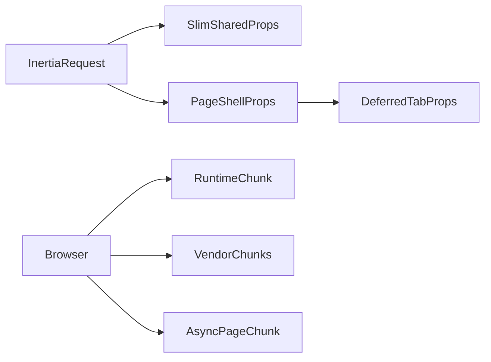

# Inertia React Performance — Overview (P0 + P1)

**Companion checklist:** [inertia-react-performance-checklist.md](./inertia-react-performance-checklist.md)

**Related (Index-only):** [leads-deals-index-performance-overview.md](./leads-deals-index-performance-overview.md) / [leads-deals-index-performance-checklist.md](./leads-deals-index-performance-checklist.md) — non-breaking Leads/Deals **Index** optimization (dead loaders, view-aware kanban, modal-safe prop slim). Show defer remains Phase C here.

**Goal:** Make Inertia React pages load and navigate faster by (1) splitting the Mix/Webpack JS bundle, (2) shrinking shared Inertia props, and (3) deferring Lead/Deal Show tab data until needed.

**Out of scope for this roadmap:** Vite migration, P2 polish (layout/polyfill trim, deeper permission caching as a standalone phase beyond what B touches), Leads/Deals Index controller work (see Index docs above).

---

## 1. Problem summary

Cold loads of Inertia pages feel slow because three costs stack:

| Layer | What happens today | Approx. evidence |
|-------|--------------------|------------------|
| **JS download + parse** | Single Mix entry `public/js/inertia.js` bundles ~236 pages + Ant Design + charts/editors via sync `require()` | ~6.6MB raw / ~1.7MB gzip |
| **Shared Inertia JSON** | Every visit ships full translation dictionaries, countries, currencies, duplicate permission maps, company theme | ~308KB PHP lang source for shared translation files alone |
| **Page props (Show)** | Lead/Deal Show controllers load notes, tasks, files, proposals, employees, projects, etc. before first paint | Controllers return everything in one `Inertia::render` |

### Key code locations

- Entry / page resolve: [`resources/js/inertia.tsx`](../resources/js/inertia.tsx) — sync `require(\`./Pages/${name}\`)`
- Mix config: [`webpack.mix.js`](../webpack.mix.js) — no `splitChunks`; source maps enabled
- Root view: [`resources/views/layouts/inertia_alt.blade.php`](../resources/views/layouts/inertia_alt.blade.php) — `mix('js/inertia.js')` (production path)
- Middleware: [`app/Http/Middleware/HandleInertiaRequests.php`](../app/Http/Middleware/HandleInertiaRequests.php) — `share()`
- Lead Show: [`app/Http/Controllers/LeadContactController.php`](../app/Http/Controllers/LeadContactController.php) (`show`)
- Deal Show: [`app/Http/Controllers/DealController.php`](../app/Http/Controllers/DealController.php) (`show`)
- i18n bootstrap: [`resources/js/lib/i18n.ts`](../resources/js/lib/i18n.ts), [`resources/js/contexts/TranslationContext.tsx`](../resources/js/contexts/TranslationContext.tsx)

---

## 2. Target architecture

**After Phases A–C:**

1. Browser loads a small Mix **runtime** + **vendor** chunks (cacheable across navigations), then the **page chunk** for the current Inertia component.
2. Inertia shared props keep auth/locale/feature flags/company metadata — **not** full translation dictionaries or full country/currency lists.
3. Translations load once from a **dedicated cached JSON endpoint** (see §4).
4. Lead/Deal Show first response is a **shell**; tab-heavy props use Inertia **deferred** props and hydrate when tabs mount (existing `router.reload({ only: [...] })` patterns remain valid).

---

## 3. Phase map

| Phase | Theme | Checklist tasks | Primary win |
|-------|--------|-----------------|-------------|
| **A** | Mix `splitChunks` + async page imports | A1–A4 | Faster cold JS load |
| **B** | Slim shared props + translations endpoint | B1–B4 | Smaller every Inertia response |
| **C** | Defer Lead/Deal Show tab data | C1–C4 | Faster TTFB / first paint on core CRM pages |

**Recommended order:** A → B → C.

- A and B/C are largely independent (frontend bundling vs server props), but cold-load wins need A first.
- B2 (translations) should land before treating “Inertia JSON size” as fixed.
- C depends on clear shell vs deferred prop lists (C1) before controller/UI work (C2–C4).

---

## 4. Locked decisions

### 4.1 Bundler: Laravel Mix + Webpack `splitChunks` (not Vite)

- Keep production root view as `layouts.inertia_alt` ([`HandleInertiaRequests::$rootView`](../app/Http/Middleware/HandleInertiaRequests.php)).
- Do **not** switch to `layouts.inertia_vite` as part of this work.
- Enable Webpack `optimization.splitChunks` via Mix `.webpackConfig`.
- Change page resolve from sync `require` to **async dynamic `import()`** so pages become separate chunks.

### 4.2 Translations (Task B2): dedicated JSON endpoint

**Chosen approach (do not substitute without updating both docs):**

1. Remove `translations` and `fallbackTranslations` from Inertia `share()` (keep `locale`, `isRtl`, `availableLocales`).
2. Add a lightweight authenticated (or session-aware) route, e.g. `GET /api/i18n/{locale}.json` (exact path TBD in B2), that returns the flattened dictionary already produced by `getTranslations()` / English fallback.
3. Cache per locale (existing `Cache::remember("translations_{$locale}", …)` logic moves or is reused by the endpoint).
4. Client: on boot (and on locale change), fetch the JSON and call `initI18n(locale, translations, fallback)` from [`resources/js/lib/i18n.ts`](../resources/js/lib/i18n.ts). Update [`TranslationContext`](../resources/js/contexts/TranslationContext.tsx) / [`inertia.tsx`](../resources/js/inertia.tsx) so they no longer expect dictionaries in page props.
5. Optional: send `Cache-Control` / ETag so browsers reuse the asset across navigations.

**Rationale:** dictionaries are large and change rarely relative to page props; embedding them in every Inertia document/XHR is the wrong cache boundary.

### 4.3 Countries / currencies (Task B3)

- Remove from global `share()`.
- Pass as **page props** where controllers already merge form data, **or** fetch once via a small reference-data endpoint / React Query cache used by forms that need them (`usePage().props.countries` consumers must be updated).

### 4.4 Lead/Deal defer (Phase C)

- Use Inertia v2 deferred props (`Inertia::defer` / equivalent already supported by `@inertiajs/react` ^2.2.7).
- First paint keeps: entity core, permissions needed for chrome, feature flags, AI summary if already cheap/cached, meeting types if shown in header actions.
- Defer: notes, tasks (+ task metadata lists), follow-ups (if not above-the-fold), files, proposals, histories/activities bulk, `employees`, `projects`, and other tab-only payloads — exact list locked in **C1**.

---

## 5. Constraints

- Preserve Ant Design + provider stack ([`resources/js/providers`](../resources/js/providers)).
- Existing `router.reload({ only: [...] })` partial reloads must keep working after deferred props.
- Redesign and legacy Lead/Deal Show paths both must tolerate missing deferred keys until loaded ([`Leads/Show.tsx`](../resources/js/Pages/Leads/Show.tsx), [`Deals/Show.tsx`](../resources/js/Pages/Deals/Show.tsx) + Redesign trees).
- Do not break Blade/Mix asset URLs (`mix-manifest.json` / chunk `publicPath`).
- Impl-only work must leave Verify steps for a later pass (see checklist how-to).

---

## 6. Risks

| Risk | Mitigation |
|------|------------|
| Chunk 404s / wrong `publicPath` after splitChunks | A3: verify Mix output paths and blade script tags against `mix-manifest.json` |
| Ant Design still large in vendor chunk | Acceptable for P0; vendor caches across pages; further antd tree-shaking is later |
| Flash of untranslated UI after B2 | Gate chrome on `isReady` or show skeleton until i18n fetch completes; fetch early in bootstrap |
| Deferred props crash UI expecting arrays | C4: default to `[]` / loading states; use Inertia deferred hooks |
| Source maps bloating deploy | A4: disable production source maps |

---

## 7. Success metrics (for Verify passes — not impl-only)

Use these when running `Verify Task …` from the checklist:

1. **Initial JS:** entry + critical path JS for a simple Inertia page much smaller than today’s single 6.6MB file (target: vendor cached; page chunk only for that route).
2. **Shared JSON:** Inertia payload no longer includes full `translations` / `fallbackTranslations` / global `countries` / `currencies`.
3. **Lead/Deal Show:** document TTFB and payload size drop vs baseline; tab data appears after defer resolve without full-page blank.
4. **Smoke:** open Leads Index, Lead Show (legacy + redesign if flagged), Deals Index, Deal Show, language switch — no console chunk errors, no missing critical UI.

Baseline snapshot (pre-change, for comparison):

- `public/js/inertia.js` ≈ 6.6MB (~1.7MB gzip)
- ~236 page components under `resources/js/Pages`
- Production layout: `inertia_alt` + Mix

---

## 8. How to use these docs

1. Read this overview for context and locked decisions.
2. Execute work from [inertia-react-performance-checklist.md](./inertia-react-performance-checklist.md) using the copy-paste prompts.
3. Prefer **`Implement Task {ID} (impl only)`** so verification does not block implementation.
4. Run **`Verify Task {ID}`** later (or batch verify a phase).
5. For Leads/Deals **Index** controller and modal prop work, use [leads-deals-index-performance-checklist.md](./leads-deals-index-performance-checklist.md) instead.
