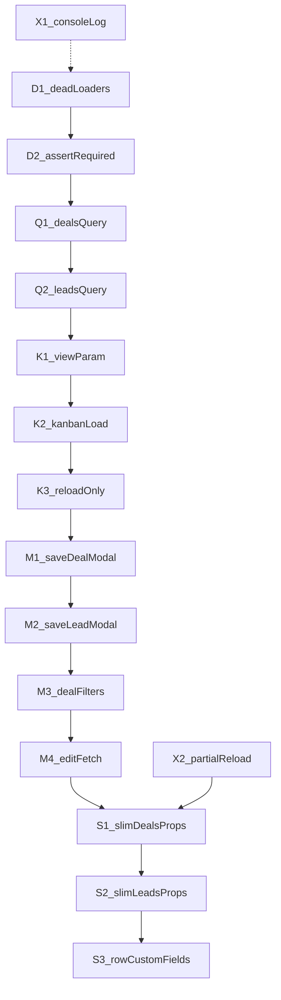

# Leads & Deals Index Performance — Implementation Checklist

**Overview:** [leads-deals-index-performance-overview.md](./leads-deals-index-performance-overview.md)

**Related:** [inertia-react-performance-checklist.md](./inertia-react-performance-checklist.md) (bundle / shared props / Show defer — separate track)

Use this checklist for Index-only work. Each task separates **Impl** from **Verify**. Prefer `(impl only)` so testing does not block implementation.

---

## How to run tasks

| Mode | Prompt pattern |
|------|----------------|
| **Impl only** | `Implement Task {ID} (impl only). Follow docs/leads-deals-index-performance-checklist.md. Do not run verify steps or write tests unless asked.` |
| **Verify only** | `Verify Task {ID}. Follow the Verify section in docs/leads-deals-index-performance-checklist.md. Do not change production code unless fixing a verify failure.` |
| **Both** | `Implement + Verify Task {ID}. Follow docs/leads-deals-index-performance-checklist.md.` |

**Impl-only definition of done:** code matches Impl steps; app still boots / Index routes respond; Verify bullets remain unchecked.

**Recommended order:** D1 → D2 → Q1 → Q2 → K1 → K2 → K3 → M1 → M2 → M3 → M4 → S1 → S2 → S3 → X1 → X2.



**Hard rule:** do **not** implement Phase S before Phase M. Removing Index props while modals/filters still read them is a breaking change.

### Regression checklist (use during Verify)

- [ ] Deals Index table: list, paginate, sort, search/filter
- [ ] Deals: switch table ↔ kanban; columns and cards load
- [ ] Deals: create + edit from Index (dropdowns, custom fields, save)
- [ ] Deals: agent change from table; refresh
- [ ] Leads Index: list, paginate, filters, lifecycle inline edit
- [ ] Leads: create + edit from Index (custom fields, save)

---

## Phase D — Dead server work (zero UI risk)

### Task D1 — Stop unused `loadDataForView` work on Deals Index

| | |
|--|--|
| **Goal** | Index must not run `Deal::all()`, unused totals, or other loaders that never feed the Inertia response. |
| **Depends on** | None |
| **Files** | [`app/Http/Controllers/DealController.php`](../app/Http/Controllers/DealController.php) (`index`, `loadDataForView`, `loadDealData`, `loadDealLeads`, …) |

#### Impl

1. In `index()`, identify what `loadDataForView()` populates vs what `Inertia::render('Deals/Index', …)` actually returns.
2. Stop calling loaders that only set unused `$this->*` for the Inertia Index path (especially `loadDealData()` → `Deal::all()`, and full lead dumps via `loadDealLeads()` if unused by the render array).
3. Prefer a dedicated slim loader used only by Index (pipelines, default pipeline, whatever Index still needs **before** Phase S) rather than the Blade-era `loadDataForView()` kitchen sink.
4. Do **not** remove props from the Inertia response in this task (that is Phase S).

#### Out of scope

- Changing `getDealFormData()` merge (S1)
- Kanban view detection (K1)
- Lead Index

#### Verify (later)

- [ ] Deals Index (table) still renders list and filters
- [ ] Query log / Debugbar: no `select *` equivalent loading all deals for Index
- [ ] Create/edit deal from Index still works (props unchanged)

#### Prompt

```text
Implement Task D1 (impl only). Follow docs/leads-deals-index-performance-checklist.md.
Do not run verify steps or write tests unless asked.
```

---

### Task D2 — Assert required Index loader outputs

| | |
|--|--|
| **Goal** | Document and leave only `$this->*` / data that Index still needs; isolate or delete the rest. |
| **Depends on** | D1 |
| **Files** | [`DealController.php`](../app/Http/Controllers/DealController.php); short comment or checklist note in PR |

#### Impl

1. List every value `index()` still needs after D1 (e.g. `$this->pipelines`, `$this->defaultPipeline` if still used).
2. Remove or private-gate remaining dead loaders for the Inertia Index path.
3. Add a brief code comment above the Index-only loader: “Do not reintroduce Deal::all() / unused Blade stats here.”

#### Out of scope

- Frontend changes
- Form-data API work (M)

#### Verify (later)

- [ ] No regression vs D1 Verify
- [ ] Code search: Index path does not call `Deal::all()`

#### Prompt

```text
Implement Task D2 (impl only). Follow docs/leads-deals-index-performance-checklist.md.
Do not run verify steps or write tests unless asked.
```

---

## Phase Q — List query trim (same table UI)

### Task Q1 — Trim Deals list query

| | |
|--|--|
| **Goal** | Same table columns; less eager-loading and JSON. |
| **Depends on** | D2 recommended |
| **Files** | [`DealController::getDealsQuery`](../app/Http/Controllers/DealController.php), [`resources/js/Features/Deals/Columns/index.tsx`](../resources/js/Features/Deals/Columns/index.tsx) |

#### Impl

1. Audit `DEAL_TABLE_COLUMNS` for relations actually rendered (contact, agent, stage, counts, etc.).
2. Remove eager-load of `tasks` with nested `deals` / `leads` / `properties`; **keep** `withCount` for `tasks_count` / `meetings_count` / `activities_count` if columns use them.
3. Trim any other `with()` relations not used by the table (do not break AgentSelector / contact links).
4. Leave per-row `withCustomFields()` for now (S3 / M4).

#### Out of scope

- Kanban card payload
- Removing `custom_fields_data` from rows

#### Verify (later)

- [ ] Table columns look identical (counts, agent, contact, stage, value)
- [ ] No N+1 explosion; Network JSON smaller or query count down

#### Prompt

```text
Implement Task Q1 (impl only). Follow docs/leads-deals-index-performance-checklist.md.
Do not run verify steps or write tests unless asked.
```

---

### Task Q2 — Trim Leads list query (if safe)

| | |
|--|--|
| **Goal** | Confirm [`LEAD_TABLE_COLUMNS`](../resources/js/Features/Leads/Columns/index.tsx) needs; trim unused select/with. |
| **Depends on** | None (can parallel Q1) |
| **Files** | [`app/Services/LeadService.php`](../app/Services/LeadService.php) (`getPaginatedLeads`), Lead columns |

#### Impl

1. Map each column to selected attributes / relations.
2. Keep fields required for lifecycle inline edit (`lead_lifecycle_status_id`, `leadLifecycleStatuses` prop stays on Index).
3. Trim only clearly unused columns/relations; keep `withCustomFields` / `mergeOntoLead` until M4/S3.
4. Do not change permission scoping or filters.

#### Out of scope

- Dropping Index props (`customFields`, etc.) — S2
- Removing `console.log` — X1

#### Verify (later)

- [ ] Leads table + lifecycle Select still work
- [ ] Filters/search/pagination unchanged

#### Prompt

```text
Implement Task Q2 (impl only). Follow docs/leads-deals-index-performance-checklist.md.
Do not run verify steps or write tests unless asked.
```

---

## Phase K — View-aware board columns

### Task K1 — Detect table vs kanban on Index request

| | |
|--|--|
| **Goal** | Server knows view mode so it can skip `getBoardColumns` for table. |
| **Depends on** | D1 |
| **Files** | [`DealController@index`](../app/Http/Controllers/DealController.php), [`resources/js/Pages/Deals/Index.tsx`](../resources/js/Pages/Deals/Index.tsx), [`useViewPreference`](../resources/js/Hooks/useViewPreference.ts) |

#### Impl

1. Align frontend preference with a request signal (preferred: query `view=table|kanban` on Index navigations / first load when preference is kanban).
2. In `index()`, if view is `table` (default when missing), **do not** call `getBoardColumns`; set `boardColumns` to `[]`.
3. If view is `kanban`, call `getBoardColumns` as today.
4. Ensure ModeSwitcher / preference changes update the query (or trigger K2 reload) so server stays in sync.

#### Out of scope

- Changing kanban deals API
- Slimming `getDealFormData` (S1)

#### Verify (later)

- [ ] Cold load with table preference: no board column count/value query storm
- [ ] Cold load / navigate with kanban preference: columns present

#### Prompt

```text
Implement Task K1 (impl only). Follow docs/leads-deals-index-performance-checklist.md.
Do not run verify steps or write tests unless asked.
```

---

### Task K2 — Load board columns when switching to kanban

| | |
|--|--|
| **Goal** | Switching to kanban never leaves a broken empty board. |
| **Depends on** | K1 |
| **Files** | [`Deals/Index.tsx`](../resources/js/Pages/Deals/Index.tsx), optionally kanban column API routes |

#### Impl

1. On switch to kanban: `router.reload({ only: ['boardColumns'], data: { view: 'kanban' } })` **or** dedicated columns endpoint if one already exists — prefer existing patterns.
2. Guard UI: `boardColumns: []` must not crash; show loading/empty until columns arrive.
3. Keep using existing infinite/kanban deals fetch for cards (do not reintroduce full deal lists into Index props).

#### Out of scope

- Full page `window.location.reload()` as the only strategy (avoid if reload-only works)
- Lead boards

#### Verify (later)

- [ ] Table → kanban: columns appear; cards load
- [ ] Kanban → table: table still works; subsequent table Index visits stay light

#### Prompt

```text
Implement Task K2 (impl only). Follow docs/leads-deals-index-performance-checklist.md.
Do not run verify steps or write tests unless asked.
```

---

### Task K3 — Agent change / refresh only request boardColumns when kanban

| | |
|--|--|
| **Goal** | Partial reloads do not re-pay board work in table mode. |
| **Depends on** | K2 |
| **Files** | [`Deals/Index.tsx`](../resources/js/Pages/Deals/Index.tsx) (agent change, `usePageRefresh`, etc.) |

#### Impl

1. Replace `router.reload({ only: ["deals", "boardColumns"] })` with:
   - table: `only: ["deals"]`
   - kanban: `only: ["deals", "boardColumns"]` (or deals via React Query invalidate + columns only as needed)
2. Refresh button: same view-aware `only` list; avoid unnecessary full `window.location.reload()` if invalidation + reload suffices.

#### Out of scope

- Changing change-agent API

#### Verify (later)

- [ ] Agent change in table updates row without board queries
- [ ] Agent change / refresh in kanban keeps board consistent

#### Prompt

```text
Implement Task K3 (impl only). Follow docs/leads-deals-index-performance-checklist.md.
Do not run verify steps or write tests unless asked.
```

---

## Phase M — Modal & filter self-sufficiency (enables prop slim)

### Task M1 — SaveDealModal loads form data on open

| | |
|--|--|
| **Goal** | Deal create/edit can work without Index shipping deferred form helpers. |
| **Depends on** | K3 recommended (ordering); required before S1 |
| **Files** | [`SaveDealModal.tsx`](../resources/js/Features/Deals/SaveDeal/SaveDealModal.tsx), [`DealForm.tsx`](../resources/js/Features/Deals/SaveDeal/DealForm.tsx), [`DealDetailsTab.tsx`](../resources/js/Features/Deals/SaveDeal/DealDetailsTab.tsx), [`useFormData` / batch](../resources/js/Hooks/useFormData.ts), form-data API backend if types missing |

#### Impl

1. When modal `open`, fetch (batch) at least: lead contacts (searchable/paginated if possible), employees, custom field definitions, pipeline↔category map as needed.
2. Extend `/account/api/form-data` / batch types if any key is missing.
3. **Fallback:** while fetch pending or if API incomplete, still read existing page props (non-breaking during migration).
4. Prefer page props only as fallback — primary path is API when available.

#### Out of scope

- Removing props from Index (S1)
- Lead modal (M2)

#### Verify (later)

- [ ] Create deal from Index with dropdowns populated
- [ ] Edit deal: watchers/participants/lead contact/custom fields work
- [ ] Works even if deferred props were empty (simulate after S1 in verify of S1)

#### Prompt

```text
Implement Task M1 (impl only). Follow docs/leads-deals-index-performance-checklist.md.
Do not run verify steps or write tests unless asked.
```

---

### Task M2 — SaveLeadModal loads custom field defs on open

| | |
|--|--|
| **Goal** | Lead create/edit does not require Index to always ship `customFields`. |
| **Depends on** | M1 pattern |
| **Files** | [`SaveLeadModal.tsx`](../resources/js/Features/Leads/SaveLead/SaveLeadModal.tsx), form-data hooks/API |

#### Impl

1. On modal open, load lead custom field definitions (and categories if required) via form-data API.
2. Fall back to `props.customFields` / `leadCustomFields` until loaded.
3. Do not remove Index props yet (S2).

#### Out of scope

- Changing Lead Show
- Removing row `custom_fields_data` (M4/S3)

#### Verify (later)

- [ ] Create/edit lead from Index: custom fields render and save

#### Prompt

```text
Implement Task M2 (impl only). Follow docs/leads-deals-index-performance-checklist.md.
Do not run verify steps or write tests unless asked.
```

---

### Task M3 — Deals filters via `useFormDataBatch`

| | |
|--|--|
| **Goal** | Match Leads Index filter pattern so Index can stop owning large filter option arrays. |
| **Depends on** | M1 recommended |
| **Files** | [`Deals/Index.tsx`](../resources/js/Pages/Deals/Index.tsx), [`createDealFilterConfig`](../resources/js/configs/dealFilterConfig.ts), [`useFormDataBatch`](../resources/js/Hooks/useFormData.ts) |

#### Impl

1. Batch-fetch filter options (categories, sources, packages, lead-agents, pipelines/stages as applicable) like Leads Index.
2. Build `createDealFilterConfig` from batch data; keep page props as fallback until S1.
3. Show drawer loading state while batch loads (Leads already passes `loading={formDataLoading}`).

#### Out of scope

- Redesigning filter UX
- Removing props (S1)

#### Verify (later)

- [ ] Filter drawer options populate
- [ ] Applying filters still updates the deals list

#### Prompt

```text
Implement Task M3 (impl only). Follow docs/leads-deals-index-performance-checklist.md.
Do not run verify steps or write tests unless asked.
```

---

### Task M4 — Edit-from-Index custom field values

| | |
|--|--|
| **Goal** | Safe path to stop attaching `custom_fields_data` on every list row later (S3). |
| **Depends on** | M1 (deals), M2 (leads) |
| **Files** | SaveDealModal / SaveLeadModal; optional show/patch API |

#### Impl

1. When opening **edit** from Index, ensure custom field **values** are present: either keep using row `custom_fields_data` for now, **or** fetch deal/lead detail (or custom fields payload) on open.
2. If implementing fetch-on-open, do it **before** S3 removes row custom fields.
3. Document in PR: “S3 must not land before M4 fetch path is verified.”

#### Out of scope

- Actually removing `withCustomFields` from Index (S3)

#### Verify (later)

- [ ] Edit deal/lead from Index shows existing custom field values
- [ ] Save persists values correctly

#### Prompt

```text
Implement Task M4 (impl only). Follow docs/leads-deals-index-performance-checklist.md.
Do not run verify steps or write tests unless asked.
```

---

## Phase S — Slim Index props (after M)

### Task S1 — Slim Deals Index Inertia props

| | |
|--|--|
| **Goal** | Index no longer merges full `getDealFormData()` (especially deferred helpers). |
| **Depends on** | **M1, M3** (required) |
| **Files** | [`DealController@index`](../app/Http/Controllers/DealController.php), [`DealFormDataTrait`](../app/Traits/DealFormDataTrait.php), Deals Index types |

#### Impl

1. Stop `array_merge(..., $this->getDealFormData())` on Index.
2. Pass only what Index still needs for first paint after M3 (e.g. pipelines/defaultPipeline/filters metadata). Prefer **not** including `getDealShowDeferredFormData()` (`employees`, `Lead::allLeads()`, etc.).
3. If any shell filter props remain briefly, keep them minimal; prefer empty + client batch.
4. Update TypeScript `IndexProps` to match (optional fields / removed keys).

#### Out of scope

- Show page form data (keep Show on its own shell/defer split)
- S3 row custom fields

#### Verify (later)

- [ ] Index JSON lacks full employees / all lead contacts lists
- [ ] Create/edit + filters still work via M1/M3
- [ ] Kanban path from K still works

#### Prompt

```text
Implement Task S1 (impl only). Follow docs/leads-deals-index-performance-checklist.md.
Do not run verify steps or write tests unless asked.
```

---

### Task S2 — Slim Leads Index props

| | |
|--|--|
| **Goal** | Drop unused Index props; keep lifecycle statuses. |
| **Depends on** | **M2** before removing `customFields` |
| **Files** | [`LeadContactController@index`](../app/Http/Controllers/LeadContactController.php), [`Leads/Index.tsx`](../resources/js/Pages/Leads/Index.tsx) |

#### Impl

1. Remove `leadContacts` / `stages` from Index render if unused by the page (confirm with grep).
2. Remove `customFields` / `customFieldCategories` only after M2 fallback is unnecessary (API primary).
3. **Keep** `leadLifecycleStatuses` for the inline status cell.
4. Keep paginated `leads` payload shape stable for `DataTable`.

#### Out of scope

- Changing LeadService permission filters
- S3

#### Verify (later)

- [ ] Leads Index + filters + lifecycle edit OK
- [ ] Create/edit lead OK without Index `customFields`

#### Prompt

```text
Implement Task S2 (impl only). Follow docs/leads-deals-index-performance-checklist.md.
Do not run verify steps or write tests unless asked.
```

---

### Task S3 — Stop Index row `withCustomFields` (after M4)

| | |
|--|--|
| **Goal** | Remove per-row custom field hydration from list queries once edit-open fetch is safe. |
| **Depends on** | **M4** (required) |
| **Files** | [`DealController@index`](../app/Http/Controllers/DealController.php) map, [`LeadService::getPaginatedLeads`](../app/Services/LeadService.php) |

#### Impl

1. Remove per-item `withCustomFields()` / unnecessary `mergeOntoLead` from Index pagination transforms **only if** M4 fetch-on-edit is in place and verified.
2. If M4 chose to keep row data, **skip this task** and leave a checklist note — do not force-break edit.
3. Ensure table columns still have core attributes they display.

#### Out of scope

- Custom fields on Show pages

#### Verify (later)

- [ ] Edit-from-Index still shows custom field values (via M4)
- [ ] List response smaller; fewer custom-field queries per page

#### Prompt

```text
Implement Task S3 (impl only). Follow docs/leads-deals-index-performance-checklist.md.
Do not run verify steps or write tests unless asked.
```

---

## Phase X — Hygiene

### Task X1 — Remove Leads Index debug log

| | |
|--|--|
| **Goal** | Remove `console.log(formData, "FORM DATA")` from Leads Index. |
| **Depends on** | None |
| **Files** | [`resources/js/Pages/Leads/Index.tsx`](../resources/js/Pages/Leads/Index.tsx) |

#### Impl

1. Delete the debug `console.log` for form data.
2. No behavior changes.

#### Out of scope

- Other console logs elsewhere

#### Verify (later)

- [ ] Browser console clean of that log on Leads Index

#### Prompt

```text
Implement Task X1 (impl only). Follow docs/leads-deals-index-performance-checklist.md.
Do not run verify steps or write tests unless asked.
```

---

### Task X2 — Prefer narrow `router.reload` / `only` lists

| | |
|--|--|
| **Goal** | After props are slim, avoid reloading unused keys. |
| **Depends on** | S1 / S2 recommended; K3 for deals board |
| **Files** | Leads/Deals Index and related hooks |

#### Impl

1. Audit Index `router.get` / `router.reload` call sites.
2. Use `only: ['leads']` or `only: ['deals']` (and `boardColumns` only when kanban) where safe.
3. Preserve `preserveState` / `preserveScroll` behavior users already have.

#### Out of scope

- Global Inertia shared-prop work

#### Verify (later)

- [ ] Pagination/filter navigations only refresh list props
- [ ] No missing prop flicker for chrome that still needs shared auth

#### Prompt

```text
Implement Task X2 (impl only). Follow docs/leads-deals-index-performance-checklist.md.
Do not run verify steps or write tests unless asked.
```

---

## Phase verify batch (optional)

```text
Verify Phase D (tasks D1–D2). Follow Verify sections in docs/leads-deals-index-performance-checklist.md.
Do not implement new features; only fix regressions found by verify.
```

```text
Verify Phase Q (tasks Q1–Q2). Follow Verify sections in docs/leads-deals-index-performance-checklist.md.
Do not implement new features; only fix regressions found by verify.
```

```text
Verify Phase K (tasks K1–K3). Follow Verify sections in docs/leads-deals-index-performance-checklist.md.
Do not implement new features; only fix regressions found by verify.
```

```text
Verify Phase M (tasks M1–M4). Follow Verify sections in docs/leads-deals-index-performance-checklist.md.
Do not implement new features; only fix regressions found by verify.
```

```text
Verify Phase S (tasks S1–S3). Follow Verify sections in docs/leads-deals-index-performance-checklist.md.
Do not implement new features; only fix regressions found by verify.
```

---

## Quick reference — task IDs

| ID | Title |
|----|--------|
| D1 | Stop unused `loadDataForView` work on Deals Index |
| D2 | Assert required Index loader outputs |
| Q1 | Trim Deals list query |
| Q2 | Trim Leads list query (if safe) |
| K1 | Detect table vs kanban on Index request |
| K2 | Load board columns when switching to kanban |
| K3 | Agent change / refresh view-aware `only` |
| M1 | SaveDealModal loads form data on open |
| M2 | SaveLeadModal loads custom field defs on open |
| M3 | Deals filters via `useFormDataBatch` |
| M4 | Edit-from-Index custom field values |
| S1 | Slim Deals Index Inertia props |
| S2 | Slim Leads Index props |
| S3 | Stop Index row `withCustomFields` (after M4) |
| X1 | Remove Leads Index debug log |
| X2 | Prefer narrow `router.reload` / `only` lists |
