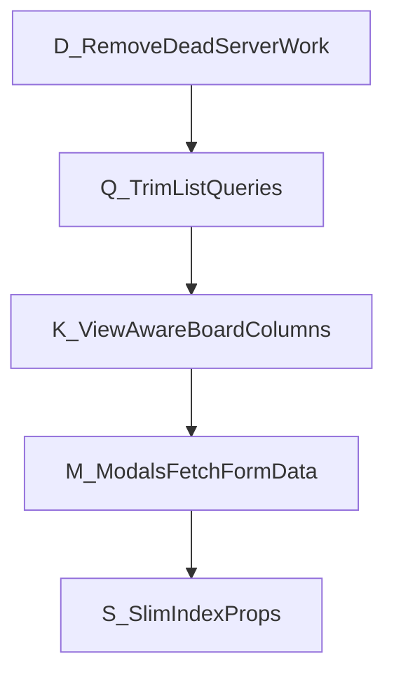
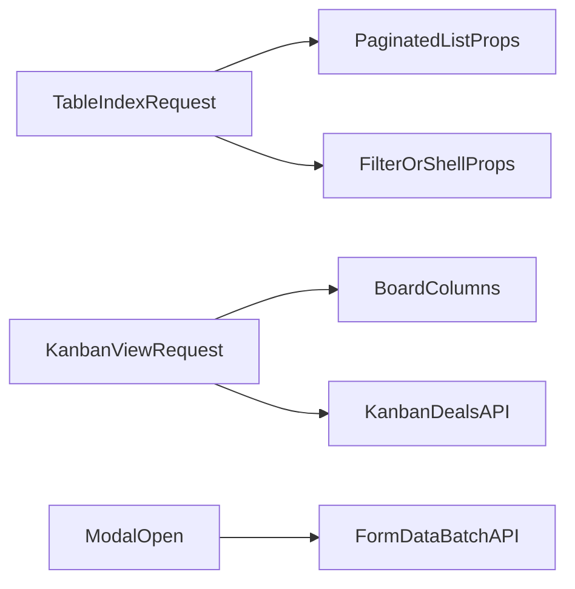

# Leads & Deals Index Performance — Overview

**Companion checklist:** [leads-deals-index-performance-checklist.md](./leads-deals-index-performance-checklist.md)

**Related (global Inertia / Show defer):** [inertia-react-performance-overview.md](./inertia-react-performance-overview.md) — Mix splitChunks, shared props, Lead/Deal **Show** defer. This document is **Index-only**.

**Goal:** Speed up Leads Index and Deals Index without breaking create/edit modals, filters, table UX, or kanban.

**Out of scope:** Vite migration, Lead/Deal Show defer (see Inertia overview Phase C), shared translation endpoint (Inertia Phase B).

---

## 1. Problem summary

| Page | What hurts today | Key locations |
|------|------------------|---------------|
| **Deals Index** | `loadDataForView()` loads `Deal::all()` and other unused collections; always merges full `getDealFormData()` (including `User::allEmployees()`, `Lead::allLeads()`); always runs `getBoardColumns` in table mode; list query eager-loads full `tasks` graph despite `tasks_count`; per-row `withCustomFields()` | [`DealController@index`](../app/Http/Controllers/DealController.php), [`DealFormDataTrait`](../app/Traits/DealFormDataTrait.php), [`Deals/Index.tsx`](../resources/js/Pages/Deals/Index.tsx) |
| **Leads Index** | Healthier pagination + client `useFormDataBatch` for filters, but still ships `leadContacts` / `stages` / `customFields` every visit; per-row `withCustomFields()` + `mergeOntoLead`; debug `console.log` | [`LeadContactController@index`](../app/Http/Controllers/LeadContactController.php), [`LeadService`](../app/Services/LeadService.php), [`Leads/Index.tsx`](../resources/js/Pages/Leads/Index.tsx) |

Index table columns ([`DEAL_TABLE_COLUMNS`](../resources/js/Features/Deals/Columns/index.tsx), [`LEAD_TABLE_COLUMNS`](../resources/js/Features/Leads/Columns/index.tsx)) do **not** render `custom_fields_data`. However, **edit-from-Index** modals use row `custom_fields_data` and page-level field definitions — do not strip those until Phase M.

---

## 2. Locked decisions

1. **Kanban is view-aware:** skip heavy `getBoardColumns` on table-first load; load columns when the user is on / switches to kanban (aligned with [`useViewPreference`](../resources/js/Hooks/useViewPreference.ts)).
2. **Non-breaking:** never remove Index props that Create/Edit/filters still read until those consumers fetch on demand.
3. **Form-data pattern:** Deals Index converges toward Leads’ `useFormDataBatch` / `/account/api/form-data` for modal and filter reference data **after** consumers are ready.
4. **Custom fields on list rows:** keep row `custom_fields_data` until edit-open fetch exists (M4); may drop unused *definition* props only after modal migration (M1/M2).

---

## 3. Non-breaking safety order

| Rule | Meaning |
|------|---------|
| **D first** | Remove server work that never reaches Inertia props (zero UI risk) |
| **Q next** | Drop eager loads unused by table columns; UX identical |
| **K** | Table path skips board work; kanban still gets columns |
| **M before S** | Migrate modals/filters to form-data APIs before deleting Index props |
| **Verify separately** | `(impl only)` does not mean verified |

### Consumers that block early prop deletion

| Consumer | Still reads from page props |
|----------|----------------------------|
| [`SaveDealModal`](../resources/js/Features/Deals/SaveDeal/SaveDealModal.tsx) / [`DealForm`](../resources/js/Features/Deals/SaveDeal/DealForm.tsx) / [`DealDetailsTab`](../resources/js/Features/Deals/SaveDeal/DealDetailsTab.tsx) | `customFields`, `leadContacts`, `employees`, `pipelineCustomFieldCategoryIdsByPipeline` |
| [`SaveLeadModal`](../resources/js/Features/Leads/SaveLead/SaveLeadModal.tsx) | `customFields` (and related) |
| [`createDealFilterConfig`](../resources/js/configs/dealFilterConfig.ts) | categories, sources, agents, packages, pipelines/stages from Index props |
| Leads filters | already prefer `useFormDataBatch`; keep `leadLifecycleStatuses` on Index for inline status cell |

---

## 4. Target Index data flow

**After Phases D–S:**

1. **Table first paint:** paginated `deals` / `leads` + light filter options (or client form-data) — no `Deal::all()`, no deferred Show form helpers, no board column value loops.
2. **Kanban:** column metadata loaded when `view=kanban` (query/reload); card deals continue via existing kanban API.
3. **Create/Edit:** reference data loaded when modal opens (form-data), with temporary fallback to page props during migration.
4. **Partial reloads:** `only: ['deals']` / `['leads']`; include `boardColumns` only when kanban is active.

---

## 5. Phase map

| Phase | Theme | Checklist tasks | Primary win |
|-------|--------|-----------------|-------------|
| **D** | Dead server work | D1–D2 | Faster Deals Index TTFB, less memory |
| **Q** | List query trim | Q1–Q2 | Smaller queries / JSON for table rows |
| **K** | View-aware board columns | K1–K3 | Table users skip kanban server cost |
| **M** | Modal & filter self-sufficiency | M1–M4 | Unlocks safe prop slim |
| **S** | Slim Index props | S1–S3 | Smaller every Index response |
| **X** | Hygiene | X1–X2 | Cleaner client + cheaper reloads |

**Recommended order:** D → Q → K → M → S → X.  
Do **not** run S before M. X1 can run anytime; X2 is most useful after S.

---

## 6. Risks and mitigations

| Risk | Mitigation |
|------|------------|
| Empty create/edit dropdowns after prop slim | Complete M1–M3 with page-prop fallback before S |
| Edit-from-Index loses custom field values | Keep row `custom_fields_data` until M4 |
| Kanban blank / crash when `boardColumns: []` | K2: guard UI; reload columns on switch |
| Filter options empty on Deals | M3 before removing filter props in S1 |
| Lifecycle inline edit breaks | Keep `leadLifecycleStatuses` on Leads Index |

---

## 7. Success metrics (Verify passes)

1. Deals Index (table): no `Deal::all()` / unused `loadDataForView` work; no deferred form helpers in props; no `getBoardColumns` when `view=table`.
2. Switching to kanban still shows columns and loads cards.
3. Create/edit deal and lead from Index still populate fields and save.
4. Deals/Leads filters still offer options; Leads lifecycle cell still works.
5. Payload/TTFB improved vs baseline (compare Network document size and server time).

---

## 8. How to use these docs

1. Read this overview for constraints and order.
2. Execute [leads-deals-index-performance-checklist.md](./leads-deals-index-performance-checklist.md) with copy-paste prompts.
3. Prefer **`Implement Task {ID} (impl only)`**; run **`Verify Task {ID}`** later.
4. Treat global Inertia work (bundle / shared props / Show) as a separate track.
