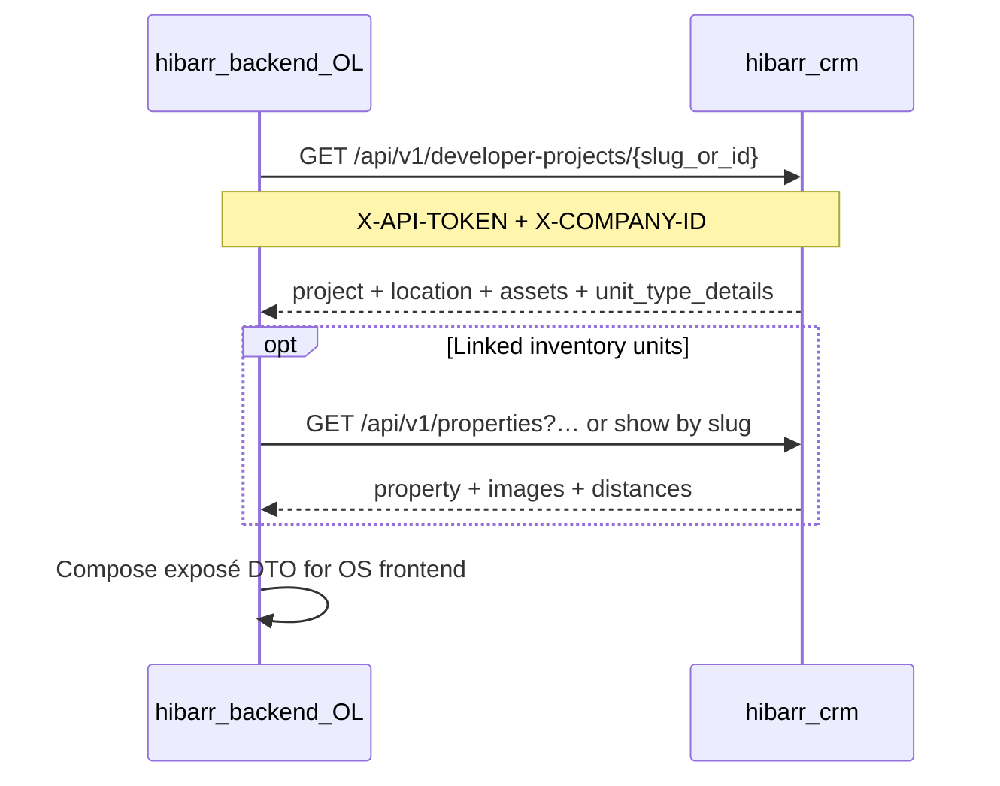

# OL Integration Guide — CRM Developer Projects API

Audience: engineers on **hibarr-backend / OL** composing Digital Exposé payloads from CRM data.

Companion surfaces:
- Property public API (same auth, envelope, and `fields=` conventions): `GET /api/v1/properties`, `GET /api/v1/properties/{identifier}`
- Ops/token mint notes: [developer-projects-public-api-notes.md](./developer-projects-public-api-notes.md)

This API is **read-only**, **company-scoped**, and authenticated with a narrowly scoped CRM API token (not session auth, not OL module:action permissions).

---

## 1. Base URL & versioning

| Environment | Pattern |
|---|---|
| CRM host | `{CRM_BASE_URL}` (e.g. staging / production Infisical) |
| Public API prefix | `/api/v1` |

Full paths used by this feature:

```text
GET {CRM_BASE_URL}/api/v1/developer-projects
GET {CRM_BASE_URL}/api/v1/developer-projects/{identifier}
```

> **Why `/api/v1`?** CRM registers these via Froiden `ApiRoute` with `config('api.default_version') = v1`, same as Properties. Do not call `/api/developer-projects` (no version) — that path is not registered.

---

## 2. Authentication & tenancy

### Required headers

| Header | Required | Description |
|---|---|---|
| `X-API-TOKEN` | Yes* | Plaintext CRM API token (`hib_…`). Prefer this header for parity with existing Property consumers. |
| `Authorization: Bearer {token}` | Yes* | Alternative to `X-API-TOKEN` (either is accepted). |
| `X-COMPANY-ID` | Strongly recommended | Numeric company id. Must match the token’s bound company when the token is company-bound. |

\* One of `X-API-TOKEN` or `Authorization: Bearer` is required.

### Token scopes (exact keys)

The exposé consumer token must include **only**:

```text
api.properties.index
api.properties.show
api.properties.expose
api.properties.filters.property_types
api.properties.filters.features
api.properties.filters.location
api.developer-projects.index
api.developer-projects.show
api.developer-projects.expose
api.developer-projects.unit-types.expose
```

Store the plaintext token in **Infisical**. CRM never returns the raw token from list/update token APIs after creation.

### Company resolution behaviour

1. Middleware resolves company from `X-COMPANY-ID` and/or the token’s `company_id`.
2. If both are present and **differ** → `401`.
3. If neither can be resolved (non-v2 routes) → `401`.
4. Controller additionally returns `400` if `X-COMPANY-ID` is still missing after middleware (defensive; company-bound tokens usually get the header filled in).

All project queries are filtered by that company id. Soft-deleted projects are excluded by Eloquent SoftDeletes.

### Hidden projects

- API **includes** projects with `is_hidden: true`.
- Every list/show item always includes `is_hidden` (boolean).
- OL should filter client-side if exposé composition should omit hidden projects.

---

## 3. Endpoints overview

| Method | Path | Scope key | Purpose |
|---|---|---|---|
| `GET` | `/api/v1/developer-projects` | `api.developer-projects.index` | Paginated list |
| `GET` | `/api/v1/developer-projects/{identifier}` | `api.developer-projects.show` | Single project by **slug first**, then numeric **id** |

---

## 4. `GET /api/v1/developer-projects` — list

### Query parameters

| Param | Type | Default | Notes |
|---|---|---|---|
| `page` | int ≥ 1 | `1` | Page number |
| `per_page` | int | `config('api.defaultLimit')` (typically `10`) | Capped at `config('api.maxLimit')` (typically `1000`) |
| `fields` | string / CSV | _(all)_ | Comma-separated top-level keys to keep on each item |
| `search` | string | — | Matches `name` or `description` |
| `sort` | string | `newest` | See sort values below |
| `developer_id` | int | — | Exact developer FK |
| `construction_status` | string | — | See enum below |
| `primary_category` | string | — | JSON-contains on `primary_categories` |
| `payment_plan_duration` | int ≥ 0 | — | Matches `payment_plan.period_months` |
| `price_min` / `price_max` | number | — | Filter on `starting_price` |
| `city` | string | — | Case-insensitive match on related location `city` |
| `area` | string | — | Used with `city` |
| `location_id` | int | — | Exact `project_location_id` (used when `city` is not set) |

Parameters may also be sent in a **JSON body** on GET (Property API convention): either top-level keys or nested under `filters`. Malformed JSON → `400`.

### Sort values

| `sort` | Behaviour |
|---|---|
| `newest` (default) | `created_at DESC` |
| `oldest` | `created_at ASC` |
| `name_asc` / `name_desc` | By `name` |
| `properties_desc` | By `properties_count` |
| `cheapest` / `most_expensive` | By `starting_price` |

### Construction status values

```text
pre_construction
active_construction
post_construction
complete
```

### Success response (200)

Envelope matches Property list API:

```json
{
  "status": "success",
  "data": [ /* DeveloperProjectListItem[] */ ],
  "current_page": 1,
  "last_page": 3,
  "per_page": 10,
  "total": 27,
  "from": 1,
  "to": 10,
  "next_page_url": "https://crm.example/api/v1/developer-projects?page=2",
  "prev_page_url": null
}
```

| Field | Type | Notes |
|---|---|---|
| `status` | `"success"` | |
| `data` | `array` | Project objects (see §6). Empty array when none — **not** an error. |
| `current_page` | int | Requested page (can be beyond `last_page`) |
| `last_page` | int | |
| `per_page` | int | |
| `total` | int | |
| `from` / `to` | int \| null | `null` when `data` is empty |
| `next_page_url` / `prev_page_url` | string \| null | Absolute URLs when applicable |

### List item shape (what is loaded)

List eager-loads: `location`, `assets`, `thumbnail`, plus `properties_count`.

List does **not** include `unit_type_details`. Use show for unit types.

### Example — curl

```bash
curl -sS \
  -H "X-API-TOKEN: ${CRM_EXPOSE_TOKEN}" \
  -H "X-COMPANY-ID: ${COMPANY_ID}" \
  "${CRM_BASE_URL}/api/v1/developer-projects?page=1&per_page=20&fields=id,slug,name,is_hidden,starting_price,location"
```

### Example — field selection response

```json
{
  "status": "success",
  "data": [
    {
      "id": 42,
      "slug": "marina-residences",
      "name": "Marina Residences",
      "is_hidden": false,
      "starting_price": "250000.00",
      "location": {
        "id": 7,
        "name": "Iskele, Famagusta",
        "city": "Famagusta",
        "area": "Iskele"
      }
    }
  ],
  "current_page": 1,
  "last_page": 1,
  "per_page": 20,
  "total": 1,
  "from": 1,
  "to": 1,
  "next_page_url": null,
  "prev_page_url": null
}
```

---

## 5. `GET /api/v1/developer-projects/{identifier}` — show

### Identifier resolution

1. Look up by **`slug`** within the company.
2. If not found and `{identifier}` is **all digits** (`ctype_digit`), look up by **numeric `id`**.
3. Otherwise → `404`.

Soft-deleted projects → `404` (not returned).

### Query parameters

| Param | Type | Notes |
|---|---|---|
| `fields` | string / CSV | Same field-selection behaviour as list |

### Success response (200)

```json
{
  "status": "success",
  "data": { /* DeveloperProjectDetail */ }
}
```

Show eager-loads: `location`, `assets`, `unitTypes.assets` (serialized as `unit_type_details`).

### Example — by slug

```bash
curl -sS \
  -H "X-API-TOKEN: ${CRM_EXPOSE_TOKEN}" \
  -H "X-COMPANY-ID: ${COMPANY_ID}" \
  "${CRM_BASE_URL}/api/v1/developer-projects/marina-residences"
```

### Example — by id

```bash
curl -sS \
  -H "X-API-TOKEN: ${CRM_EXPOSE_TOKEN}" \
  -H "X-COMPANY-ID: ${COMPANY_ID}" \
  "${CRM_BASE_URL}/api/v1/developer-projects/42"
```

### Example — detail payload (abbreviated)

```json
{
  "status": "success",
  "data": {
    "id": 42,
    "company_id": 1,
    "developer_id": 9,
    "name": "Marina Residences",
    "slug": "marina-residences",
    "reference_code": "AKACAN-001",
    "description": "Waterfront apartments…",
    "project_location_id": 7,
    "starting_price": "250000.00",
    "primary_categories": ["residential"],
    "title_deed_type": "turkish",
    "unit_types": ["apartment", "villa"],
    "construction_status": "active_construction",
    "completion_date": "2027-06-01T00:00:00.000000Z",
    "furniture_package": "fully_furnished",
    "rental_guarantee": false,
    "payment_plan": {
      "enabled": true,
      "downpayment_type": "percentage",
      "downpayment_value": 35,
      "period_months": 24,
      "interest_rate": 0
    },
    "facilities": ["pool", "gym", "parking"],
    "distances": {
      "sea_km": 0.5,
      "hospital_km": 3.2,
      "market_km": 1.1,
      "school_km": 2.0,
      "airport_km": 45,
      "beach_km": 0.4
    },
    "is_hidden": false,
    "location": {
      "id": 7,
      "company_id": 1,
      "name": "Iskele, Famagusta",
      "city": "Famagusta",
      "area": "Iskele",
      "description": null,
      "address": {
        "street": "Coast Road",
        "state": null,
        "country": "Cyprus",
        "postalCode": null
      },
      "map_url": "https://maps.example/…",
      "image_url": null,
      "latitude": "35.1234560",
      "longitude": "33.9876540",
      "attractions": [],
      "infrastructure": [],
      "airports": []
    },
    "assets": [
      {
        "id": 1001,
        "name": "Hero exterior",
        "url": "https://cdn.example/…/hero.jpg",
        "file_path": "developer-projects/42/hero.jpg",
        "external_url": null,
        "tags": ["hero", "exterior", "gallery"],
        "order": 0,
        "formatted_size": "1.2 MB"
      }
    ],
    "unit_type_details": [
      {
        "id": 501,
        "company_id": 1,
        "developer_project_id": 42,
        "reference_code": "AKACAN-001-UT01",
        "primary_category": "residential",
        "property_type": "apartment",
        "quantity": 24,
        "total_sold": 6,
        "is_sold_out": false,
        "starting_price": "250000.00",
        "currency": "GBP",
        "bedrooms": 2,
        "bathrooms": 2,
        "total_area_sqm": "95.00",
        "order": 1,
        "assets": [
          {
            "id": 2001,
            "name": "Floor plan",
            "url": "https://cdn.example/…/fp.jpg",
            "file_path": null,
            "external_url": "https://cdn.example/…/fp.jpg",
            "tags": ["floor-plan"],
            "order": 0,
            "formatted_size": null
          }
        ]
      }
    ],
    "formatted_starting_price": "£250,000",
    "created_at": "2026-03-01T12:00:00.000000Z",
    "updated_at": "2026-07-20T09:30:00.000000Z"
  }
}
```

---

## 6. Type reference (payload fields)

Types below describe the JSON OL should model against. Decimal columns may serialize as **strings** (Laravel decimal cast). Dates are ISO-8601 strings.

### 6.1 Core project fields

| Field | Type | List | Show | Notes |
|---|---|---|---|---|
| `id` | number | ✓ | ✓ | |
| `company_id` | number | ✓ | ✓ | |
| `developer_id` | number \| null | ✓ | ✓ | |
| `name` | string | ✓ | ✓ | |
| `slug` | string \| null | ✓ | ✓ | Unique per company; preferred public identifier |
| `reference_code` | string \| null | ✓ | ✓ | e.g. `AKACAN-001` |
| `description` | string \| null | ✓ | ✓ | |
| `project_location_id` | number \| null | ✓ | ✓ | |
| `google_drive_link` | string \| null | ✓ | ✓ | |
| `availability_link` | string \| null | ✓ | ✓ | |
| `starting_price` | string \| number \| null | ✓ | ✓ | Often decimal string |
| `primary_categories` | string[] \| null | ✓ | ✓ | e.g. `residential`, `commercial` |
| `title_deed_type` | string \| null | ✓ | ✓ | e.g. `turkish`, `british`, `leasehold`, … |
| `unit_types` | string[] \| null | ✓ | ✓ | **Column**: coarse type labels (`apartment`, `villa`, …). Not the relation. |
| `number_of_units` | number \| null | ✓ | ✓ | |
| `total_units` | number \| null | ✓ | ✓ | Optional override |
| `total_units_sold` | number \| null | ✓ | ✓ | Optional override |
| `number_of_blocks` | number \| null | ✓ | ✓ | |
| `project_total_area_sqm` | string \| number \| null | ✓ | ✓ | |
| `construction_status` | string \| null | ✓ | ✓ | See enum in §4 |
| `completion_date` | string \| null | ✓ | ✓ | |
| `number_of_phases` | number \| null | ✓ | ✓ | |
| `furniture_package` | string \| null | ✓ | ✓ | e.g. `unfurnished`, `fully_furnished` |
| `rental_guarantee` | boolean | ✓ | ✓ | |
| `payment_plan` | object \| null | ✓ | ✓ | See §6.2 |
| `facilities` | string[] \| null | ✓ | ✓ | **Raw facility slugs** (not enriched labels/icons) |
| `distances` | object \| null | ✓ | ✓ | See §6.3 |
| `is_hidden` | boolean | ✓ | ✓ | Always present; API includes hidden rows |
| `properties_count` | number | ✓ | — | Present when counted (list) |
| `location` | object \| null | ✓ | ✓ | ProjectLocation (§6.4) |
| `assets` | Asset[] | ✓ | ✓ | Mapped gallery assets (§6.5) |
| `thumbnail` | object \| null | ✓ | — | First ordered asset relation when loaded on list |
| `unit_type_details` | UnitType[] | — | ✓ | Full unit type records (§6.6). **Not** the same as `unit_types`. |
| `formatted_starting_price` | string \| null | ✓ | ✓ | Appended display helper |
| `created_at` / `updated_at` | string | ✓ | ✓ | |
| `deleted_at` | string \| null | ✓ | ✓ | Normally `null` (soft-deleted excluded) |

### 6.2 `payment_plan`

```ts
type PaymentPlan = {
  enabled: boolean;
  downpayment_type?: "percentage" | "amount";
  downpayment_value?: number;
  period_months?: number;
  interest_rate?: number;
} | null;
```

### 6.3 `distances`

```ts
type ProjectDistances = {
  sea_km?: number;
  hospital_km?: number;
  market_km?: number;
  school_km?: number;
  airport_km?: number;
  beach_km?: number;
} | null;
```

### 6.4 `location` (ProjectLocation)

| Field | Type | Notes |
|---|---|---|
| `id` | number | |
| `company_id` | number | |
| `name` | string \| null | Often `"Area, City"` |
| `city` / `area` | string \| null | |
| `description` | string \| null | |
| `address` | object \| null | `{ street?, state?, country?, postalCode? }` |
| `map_url` | string \| null | |
| `image_url` | string \| null | |
| `latitude` / `longitude` | string \| number \| null | |
| `attractions` | array | `[{ name, content: string[], images: { primary, secondary } }]` |
| `infrastructure` | array | `[{ infrastructure_id?, travelTimeInMin, name?, icon?, image? }]` |
| `airports` | array | `[{ airport_id?, travelTimeInMin, name?, code?, image? }]` |

### 6.5 `assets` / unit-type `assets` (mapped)

API maps assets to a Property-images-like subset:

```ts
type ApiAsset = {
  id: number;
  name: string | null;
  url: string | null;           // resolved URL (external or storage)
  file_path: string | null;
  external_url: string | null;
  tags: string[] | null;        // e.g. hero, exterior, interior, floor-plan, site-plan, gallery, facilities
  order: number | null;
  formatted_size: string | null;
};
```

Common tags: `hero`, `exterior`, `interior`, `floor-plan`, `site-plan`, `gallery`, `facilities`, `features`, `area`, `footer`. Facility-specific tags may appear as `facilities:{slug}`.

### 6.6 `unit_type_details` (show only)

```ts
type UnitTypeDetail = {
  id: number;
  company_id: number;
  developer_project_id: number;
  reference_code: string | null;
  primary_category: "residential" | "commercial" | string | null;
  property_type: string | null;
  quantity: number | null;
  total_sold: number | null;
  is_sold_out: boolean;
  unit_style: string[] | null;
  view_types: string[] | null;
  furniture_status: string | null;
  starting_price: string | number | null;
  currency: string;                 // e.g. GBP, EUR, USD, TRY
  bedrooms: number | null;
  bathrooms: number | null;
  floor: string | null;
  floors_in_building: number | null;
  total_area_sqm: string | number | null;
  living_area_sqm: string | number | null;
  terrace_balcony_sqm: string | number | null;
  plot_size_sqm: string | number | null;
  completion_date: string | null;
  outside_features: string[] | null;
  inside_features: string[] | null;
  description: string | null;
  military_base_distance_km: string | number | null;
  has_restrictions: boolean;
  restriction_notes: string | null;
  order: number;
  assets?: ApiAsset[];
  // plus timestamps / other model attributes as serialized
};
```

> **Naming collision:** `unit_types` (string[]) is the project-level category column. `unit_type_details` is the HasMany relation payload. Prefer `unit_type_details` for exposé composition.

---

## 7. `fields=` selection

Same convention as Property API:

- Pass `?fields=id,slug,name,is_hidden,location,assets`
- Or JSON body: `{ "fields": ["id", "slug", "name"] }` / `{ "filters": { "fields": "id,slug" } }`
- Response objects contain **only** requested top-level keys that exist
- Nested objects are included wholesale when their top-level key is requested (no deep field paths)
- Unknown field names are silently skipped

---

## 8. Error responses

### Auth / tenancy / scope

| Status | When | Body shape |
|---|---|---|
| `401` | Missing/invalid/revoked token, or company mismatch / unresolved company | `{ "message": "…" }` |
| `403` | Token lacks required scope for this route | `{ "message": "…" }` |
| `400` | Missing company id (controller) | `{ "status": "fail", "message": "…", "error_name": …, "data": [] }` (`Reply::error`) |
| `400` | Malformed JSON body on GET | `{ "status": "fail", "message": "Invalid JSON in request body: …" }` |

### Domain

| Status | When | Body shape |
|---|---|---|
| `404` | Unknown slug/id, or soft-deleted | `{ "status": "fail", "message": "Developer project not found" }` |
| `500` | Unexpected server error | `{ "status": "fail", "message": "Failed to fetch … reference ID: DPROJ-…", "reference_id": "DPROJ-…" }` |

Empty company catalog is **not** an error: list returns `200` with `"data": []` and `"total": 0`.

---

## 9. Recommended OL composition flow



Practical tips:

1. Prefer **`slug`** in public/composition URLs; keep `id` for internal joins.
2. Use list + `fields=` for discovery/index; use show for raw domain detail; use `/expose` for presentation-ready DTOs.
3. Filter `is_hidden === true` in OL if exposés should not surface hidden CRM projects.
4. Prefer `GET …/expose` for galleries (`assets` by tag) and `facility_items`. Catalog show still returns flat `assets[].tags` for non-exposé use.
5. Treat catalog `facilities` as **slugs**; `/expose` returns enriched `facility_items`.
6. Pair with Property API when the exposé needs per-unit inventory; use property `/expose` for a unit-level brochure DTO.
7. Discover unit type ids from project show `unit_type_details`, then call unit-type `/expose`.

---

## 10. Known gaps / expose presentation endpoints

Catalog list/show remain the discovery surface. For a **presentation-ready expose DTO** (enriched facilities, assets by tag, normalized infra/airports, agent/client/company presence), use the dedicated endpoints below (same `api.token` + `X-COMPANY-ID` auth).

| Method | Path | Scope key |
|---|---|---|
| `GET` | `/api/v1/properties/{identifier}/expose` | `api.properties.expose` |
| `GET` | `/api/v1/developer-projects/{identifier}/expose` | `api.developer-projects.expose` |
| `GET` | `/api/v1/developer-projects/{identifier}/unit-types/{unitTypeId}/expose` | `api.developer-projects.unit-types.expose` |

Optional query: `client_name`, `client_email`, `layout`, `agent_id`.

Success envelope:

```json
{
  "status": "success",
  "data": {
    "schema_version": 1,
    "entity_type": "property",
    "entity_id": 1,
    "layout": "expose-template",
    "facility_items": [{ "slug": "pool", "label": "Pool", "image_url": "https://…" }],
    "infrastructure_items": [],
    "airport_items": [],
    "assets": { "hero": [], "cover": [], "exterior": [], "interior": [], "floor-plan": [], "facilities": [] },
    "background_image_url": null,
    "unit_style_list": [],
    "completion": { "raw": null, "display": "N/A", "is_ready": false },
    "location": { "title": null, "description": null, "image_url": null },
    "attractions": [],
    "outro": { "title": "…", "description": "", "primary_image_url": null, "secondary_image_url": null },
    "agent": { "name": null, "email": null, "phone": null, "position": null, "image": null },
    "client": { "name": null, "email": null },
    "company": { "name": null, "company_name": null, "logo": null, "address": null, "phone": null, "email": null, "website": null },
    "presence": { "agent": false, "client": false, "facilities": false, "infrastructure": false, "airports": false, "cover": false, "floor_plan": false }
  },
  "warnings": []
}
```

| Need | Status on catalog show | Status on `/expose` |
|---|---|---|
| `payment_plan`, `distances`, raw `facilities` | Present | Via presentation fields |
| `location` (ProjectLocation) | Present | Normalized `location` + `infrastructure_items` / `airport_items` / `attractions` |
| Gallery assets | Flat `assets` | Pre-grouped `assets` by tag |
| `unit_type_details` | Present on project show | Use unit-type `/expose` for DTO |
| Enriched facilities (label + image) | **Not** on catalog | `facility_items` |
| Pre-grouped images / facility maps | **Not** on catalog | `assets` + `facility_items` |
| Web “statistics” / price-list aggregates | **Not** included | **Not** included |

Restricted tokens must include the new scope keys above (in addition to list/show scopes used for discovery).

---

## 11. Quick TypeScript models (OL-side sketch)

```ts
type ApiStatus = "success" | "fail";

type PaginatedProjects = {
  status: "success";
  data: DeveloperProjectListItem[];
  current_page: number;
  last_page: number;
  per_page: number;
  total: number;
  from: number | null;
  to: number | null;
  next_page_url: string | null;
  prev_page_url: string | null;
};

type ProjectShowResponse = {
  status: "success";
  data: DeveloperProjectDetail;
};

type ApiFail = {
  status: "fail";
  message: string;
  reference_id?: string;
};
```

Map `DeveloperProjectDetail` from §6; list items are the same core fields without `unit_type_details`.

---

## 12. Checklist for OL PR

- [ ] Infisical has company-bound token with scopes in §2 only
- [ ] Calls use `/api/v1/…` (not unversioned `/api/…`)
- [ ] Sends `X-API-TOKEN` (or Bearer) + matching `X-COMPANY-ID`
- [ ] Handles `401` / `403` / `404` / empty list distinctly
- [ ] Uses `slug` for stable public identifiers; falls back to `id` when needed
- [ ] Reads `unit_type_details` (not only `unit_types` string array) for unit cards
- [ ] Filters `is_hidden` if product requires
- [ ] Composes gallery from `assets` tags until enriched gallery endpoints exist
