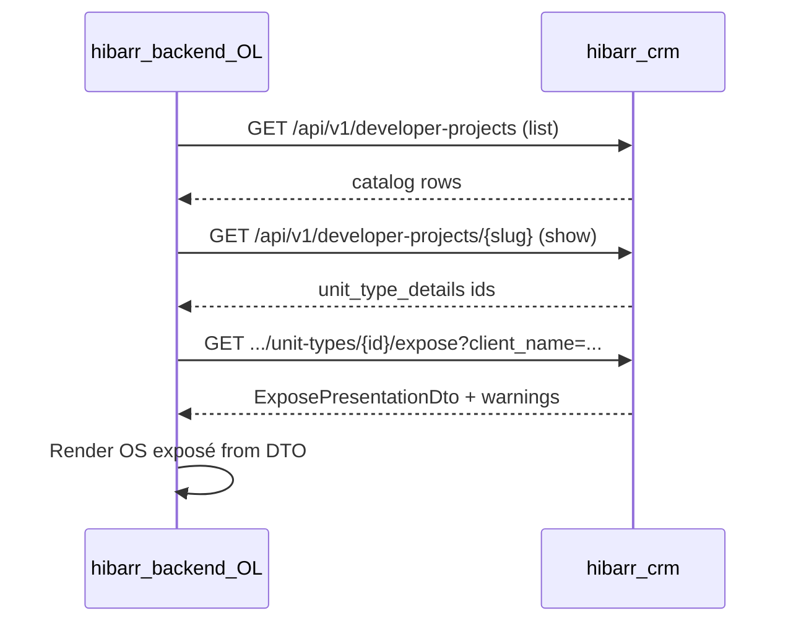

# OL Integration Guide — Expose Presentation API

Audience: engineers on **hibarr-backend / OL** (or any `api.token` consumer) who need a **presentation-ready Digital Exposé DTO**, not raw catalog JSON.

Companion docs:
- Catalog discovery (list/show): [ol-developer-projects-api-integration.md](./ol-developer-projects-api-integration.md)
- Frozen snapshot references (agent + lead mint): [ol-expose-snapshots-api.md](./ol-expose-snapshots-api.md)
- Token mint / ops notes: [developer-projects-public-api-notes.md](./developer-projects-public-api-notes.md)

This API is **read-only**, **company-scoped**, and authenticated with a CRM API token (same middleware as Properties / Developer Projects). It does **not** replace list/show — use those to discover entities, then call `/expose` for the brochure payload.

**Schema version:** `1` (field `data.schema_version`).

---

## 1. Endpoints

| Method | Path | Scope key | Default `layout` |
|---|---|---|---|
| `GET` | `/api/v1/properties/{identifier}/expose` | `api.properties.expose` | `expose-template` |
| `GET` | `/api/v1/developer-projects/{identifier}/expose` | `api.developer-projects.expose` | `project-expose-template` |
| `GET` | `/api/v1/developer-projects/{identifier}/unit-types/{unitTypeId}/expose` | `api.developer-projects.unit-types.expose` | `expose-template` |

`{identifier}` resolves **slug first**, then numeric **id** (same rule as catalog show). Soft-deleted entities → `404`.

`{unitTypeId}` must belong to the resolved project (company-scoped).

Full URL pattern:

```text
GET {CRM_BASE_URL}/api/v1/...
```

> Use `/api/v1/…` (Froiden versioning). Unversioned `/api/…` is not registered for these routes.

---

## 2. Authentication & tenancy

| Header | Required | Description |
|---|---|---|
| `X-API-TOKEN` | Yes* | Plaintext CRM API token (`hib_…`) |
| `Authorization: Bearer {token}` | Yes* | Alternative to `X-API-TOKEN` |
| `X-COMPANY-ID` | Strongly recommended | Numeric company id; must match token-bound company when both are set |

\* One of `X-API-TOKEN` or Bearer is required.

### Required scopes (restricted tokens)

```text
api.properties.expose
api.developer-projects.expose
api.developer-projects.unit-types.expose
```

Also keep catalog scopes if the client still lists/shows entities:

```text
api.properties.index
api.properties.show
api.developer-projects.index
api.developer-projects.show
```

Unrestricted tokens (null/empty scopes) retain full access.

---

## 3. Request (query parameters)

All optional. Accepted as query string (preferred) or JSON body on GET (same convention as Property API).

| Param | Type | Default | Notes |
|---|---|---|---|
| `client_name` | string | — | Personalizes `data.client.name` and sets `presence.client` |
| `client_email` | string | — | Sets `data.client.email` |
| `layout` | string | see table §1 | Passed through to `data.layout` (PDF template id); OL may ignore |
| `agent_id` | int | — | Company user id. When valid, fills `data.agent` and `presence.agent`. There is **no** session user on token routes |

### Example — curl

```bash
curl -sS \
  -H "X-API-TOKEN: ${CRM_EXPOSE_TOKEN}" \
  -H "X-COMPANY-ID: ${COMPANY_ID}" \
  "${CRM_BASE_URL}/api/v1/developer-projects/marina-residences/unit-types/501/expose?client_name=Ada%20Lovelace&agent_id=12"
```

---

## 4. Success response envelope

HTTP `200`:

```json
{
  "status": "success",
  "data": { /* ExposePresentationDto — see §5 */ },
  "warnings": [ /* ContentValidator warnings — see §8 */ ]
}
```

| Field | Type | Notes |
|---|---|---|
| `status` | `"success"` | |
| `data` | object | Always the full DTO shape (§5). Arrays are **never** `null`. |
| `warnings` | array | May be empty. Soft guidance for incomplete content (missing hero images, etc.). |

---

## 5. `data` schema (`ExposePresentationDto`, schema_version 1)

### 5.1 Null / emptiness policy

| Kind | Policy |
|---|---|
| Section arrays (`facility_items`, `infrastructure_items`, `attractions`, asset tag lists, …) | Always `[]` when empty — **never** `null` |
| `airport_items` | Always length **3** (product pads with fallbacks — see §5.6) |
| `agent` / `client` / `company` / `location` / `completion` / `outro` / `presence` | Always objects |
| Scalar fields (`title`, `description`, …) | May be `null` |
| `presence.*` | Use these to decide whether a section is meaningfully populated |

### 5.2 Top-level fields

| Field | Type | Always present | Notes |
|---|---|---|---|
| `schema_version` | `1` | ✓ | Bump only on breaking contract changes |
| `entity_type` | string | ✓ | Domain builder type, e.g. `property` (unit-type exposes currently masquerade as `property` for PDF reuse) |
| `entity_id` | number | ✓ | Property id, project id, or unit-type id depending on endpoint |
| `layout` | string | ✓ | Echo of request / default layout |
| `title` | string \| null | ✓ | |
| `description` | string \| null | ✓ | May contain HTML |
| `city` | string \| null | ✓ | |
| `price` | string \| null | ✓ | Display-formatted when available |
| `raw_price` | number \| string \| null | ✓ | Numeric / decimal source |
| `display_label` | string \| null | ✓ | Unit/property display label when available |
| `block_name` | string \| null | ✓ | |
| `bedrooms` | number \| null | ✓ | |
| `living_room` | number \| null | ✓ | |
| `facility_items` | `FacilityItem[]` | ✓ | Enriched facilities |
| `infrastructure_items` | `InfrastructureItem[]` | ✓ | Up to 4 |
| `airport_items` | `AirportItem[]` | ✓ | Always 3 slots |
| `assets` | `AssetsByTag` | ✓ | URL lists keyed by tag |
| `background_image_url` | string \| null | ✓ | Hero → exterior → interior fallback chain (may be placeholder path) |
| `unit_style_list` | string[] | ✓ | Human labels |
| `completion` | `CompletionInfo` | ✓ | |
| `location` | `LocationInfo` | ✓ | Spotlight location block |
| `attractions` | `AttractionItem[]` | ✓ | |
| `outro` | `OutroInfo` | ✓ | Company global outro + fallbacks |
| `agent` | `AgentInfo` | ✓ | |
| `client` | `ClientInfo` | ✓ | |
| `company` | `CompanyInfo` | ✓ | |
| `presence` | `PresenceFlags` | ✓ | |

### 5.3 Optional extras (when present on source entity)

Merged onto `data` when non-null:

| Field | Type | Typical source |
|---|---|---|
| `reference_code` | string | Property / project / unit type |
| `property_type` | string | |
| `unit_types` | array | Project brochure summaries (project expose) |
| `developer_name` | string | Project |

Clients should treat unknown top-level keys as forward-compatible extras.

### 5.4 Nested types

#### `FacilityItem`

```ts
type FacilityItem = {
  slug: string | null;      // e.g. "pool"; null when label-only fallback
  label: string;            // display label
  image_url: string | null; // resolved image
};
```

Resolution order per facility: `facilities:{slug}` asset → facility default image → generic `facilities` asset.

#### `InfrastructureItem`

```ts
type InfrastructureItem = {
  name: string;
  travel_time_in_min: number | string | null;
  image_url: string | null;
  icon: string | null;
};
```

Prefers expanded project-location infrastructure; else legacy `distances` rows with `type: "infrastructure"`. Cap: 4.

#### `AirportItem`

```ts
type AirportItem = {
  name: string;
  travel_time_in_min: number | string | null;
  image_url: string | null;
  code: string | null;
  source: "location" | "legacy" | "fallback";
};
```

- Always **3** items (product intent).
- Missing slots filled with default names (Ercan / Larnaca / Paphos International) and exterior/interior image fallbacks.
- `source: "fallback"` means the row was invented/padded — UI may still show it; `presence.airports` is `true` only when at least one non-fallback airport exists.

#### `AssetsByTag`

Every key always present as `string[]` (image URLs):

```ts
type AssetsByTag = {
  hero: string[];
  cover: string[];
  area: string[];
  exterior: string[];
  interior: string[];
  "floor-plan": string[];
  facilities: string[];
  gallery: string[];
  footer: string[];
  "site-plan": string[];
};
```

#### `CompletionInfo`

```ts
type CompletionInfo = {
  raw: string | number | null;  // source value (often year string)
  display: string | null;       // e.g. "Ready to move in" | "01, Jun, 2027" | "N/A"
  is_ready: boolean;            // true when parsed date is in the past
};
```

#### `LocationInfo`

```ts
type LocationInfo = {
  title: string | null;         // underscores replaced with spaces
  description: string | null;
  image_url: string | null;
};
```

#### `AttractionItem`

```ts
type AttractionItem = {
  name: string;
  description: string;
  primary_image_url: string | null;
  secondary_image_url: string | null;
};
```

#### `OutroInfo`

```ts
type OutroInfo = {
  title: string;
  description: string;          // may contain HTML
  primary_image_url: string | null;
  secondary_image_url: string | null;
};
```

Defaults applied when company outro config is empty (title default: `ROOTED IN BEAUTY, GROWING IN VALUE`).

#### `AgentInfo` / `ClientInfo` / `CompanyInfo`

```ts
type AgentInfo = {
  name: string | null;
  email: string | null;
  phone: string | null;
  position: string | null;
  image: string | null;
};

type ClientInfo = {
  name: string | null;
  email: string | null;
};

type CompanyInfo = {
  name: string | null;
  company_name: string | null;
  logo: string | null;          // URL or app path
  address: string | null;
  phone: string | null;
  email: string | null;
  website: string | null;
};
```

#### `PresenceFlags`

```ts
type PresenceFlags = {
  agent: boolean;           // agent.name filled
  client: boolean;          // client.name filled
  facilities: boolean;      // facility_items.length > 0
  infrastructure: boolean;  // infrastructure_items.length > 0
  airports: boolean;        // at least one airport with source !== "fallback"
  cover: boolean;           // assets.cover.length > 0
  floor_plan: boolean;      // assets["floor-plan"].length > 0
};
```

---

## 6. Full TypeScript contract (copy for OL)

```ts
type ExposePresentationResponse = {
  status: "success";
  data: ExposePresentationDto;
  warnings: ExposeWarning[];
};

type ExposePresentationDto = {
  schema_version: 1;
  entity_type: string;
  entity_id: number;
  layout: string;
  title: string | null;
  description: string | null;
  city: string | null;
  price: string | null;
  raw_price: number | string | null;
  display_label: string | null;
  block_name: string | null;
  bedrooms: number | null;
  living_room: number | null;
  facility_items: FacilityItem[];
  infrastructure_items: InfrastructureItem[];
  airport_items: AirportItem[]; // length 3
  assets: AssetsByTag;
  background_image_url: string | null;
  unit_style_list: string[];
  completion: CompletionInfo;
  location: LocationInfo;
  attractions: AttractionItem[];
  outro: OutroInfo;
  agent: AgentInfo;
  client: ClientInfo;
  company: CompanyInfo;
  presence: PresenceFlags;
  // optional extras
  reference_code?: string;
  property_type?: string;
  unit_types?: unknown;
  developer_name?: string;
  [key: string]: unknown;
};

type ExposeWarning = {
  severity: "error" | "warning" | "info";
  field: string;
  label: string;
  message: string;
  action?: unknown;
};

type ExposeFailResponse = {
  status: "fail";
  message: string;
  reference_id?: string;
};
```

---

## 7. Example success payload (abbreviated)

```json
{
  "status": "success",
  "data": {
    "schema_version": 1,
    "entity_type": "property",
    "entity_id": 501,
    "layout": "expose-template",
    "title": "2+1 Apartment — Marina Residences",
    "description": "<p>Bright corner unit…</p>",
    "city": "Famagusta",
    "price": "£250,000",
    "raw_price": "250000.00",
    "display_label": "2+1 Apartment",
    "block_name": null,
    "bedrooms": 2,
    "living_room": null,
    "facility_items": [
      {
        "slug": "pool",
        "label": "Swimming Pool",
        "image_url": "https://cdn.example/pool.jpg"
      }
    ],
    "infrastructure_items": [
      {
        "name": "Hospital",
        "travel_time_in_min": 12,
        "image_url": "https://cdn.example/hospital.jpg",
        "icon": null
      }
    ],
    "airport_items": [
      {
        "name": "Ercan International",
        "travel_time_in_min": 40,
        "image_url": "https://cdn.example/airport.jpg",
        "code": "ECN",
        "source": "location"
      },
      {
        "name": "Larnaca International",
        "travel_time_in_min": "",
        "image_url": "https://cdn.example/ext-1.jpg",
        "code": null,
        "source": "fallback"
      },
      {
        "name": "Paphos International",
        "travel_time_in_min": "",
        "image_url": "https://cdn.example/ext-2.jpg",
        "code": null,
        "source": "fallback"
      }
    ],
    "assets": {
      "hero": ["https://cdn.example/hero.jpg"],
      "cover": ["https://cdn.example/cover.jpg"],
      "area": [],
      "exterior": ["https://cdn.example/ext-0.jpg"],
      "interior": ["https://cdn.example/int-0.jpg"],
      "floor-plan": ["https://cdn.example/fp.png"],
      "facilities": [],
      "gallery": [],
      "footer": [],
      "site-plan": []
    },
    "background_image_url": "https://cdn.example/hero.jpg",
    "unit_style_list": ["Studio", "1+1"],
    "completion": {
      "raw": "2027",
      "display": "01, Jan, 2027",
      "is_ready": false
    },
    "location": {
      "title": "Iskele Famagusta",
      "description": "Coastal living…",
      "image_url": null
    },
    "attractions": [],
    "outro": {
      "title": "ROOTED IN BEAUTY, GROWING IN VALUE",
      "description": "",
      "primary_image_url": "https://cdn.example/hero.jpg",
      "secondary_image_url": "https://cdn.example/hero.jpg"
    },
    "agent": {
      "name": "Jane Agent",
      "email": "jane@hibarr.de",
      "phone": "+49…",
      "position": "Sales Consultant",
      "image": null
    },
    "client": {
      "name": "Ada Lovelace",
      "email": null
    },
    "company": {
      "name": "Hibarr",
      "company_name": "Hibarr",
      "logo": "https://…",
      "address": "…",
      "phone": null,
      "email": "info@hibarr.de",
      "website": "www.hibarr.de"
    },
    "presence": {
      "agent": true,
      "client": true,
      "facilities": true,
      "infrastructure": true,
      "airports": true,
      "cover": true,
      "floor_plan": true
    },
    "reference_code": "AKACAN-001-UT01"
  },
  "warnings": []
}
```

---

## 8. `warnings`

Each warning object typically includes:

| Field | Type | Notes |
|---|---|---|
| `severity` | `"error"` \| `"warning"` \| `"info"` | Soft; response is still `200` |
| `field` | string | e.g. `assets.hero` |
| `label` | string | Human label |
| `message` | string | |
| `action` | object \| undefined | Optional CRM deep-link metadata when resolver attaches it |

Clients may surface warnings in an editor UI; they are **not** hard failures.

---

## 9. Error responses

| Status | When | Body |
|---|---|---|
| `401` | Missing/invalid/revoked token, or company mismatch | `{ "message": "…" }` |
| `403` | Token lacks required scope | `{ "message": "…" }` |
| `400` | Missing company id after middleware (defensive) | `Reply::error` shape (`status: "fail"`, …) |
| `404` | Unknown property/project/unit type | `{ "status": "fail", "message": "…" }` |
| `500` | Unexpected builder/server error | `{ "status": "fail", "message": "…", "reference_id": "EXPOSE-…" }` |

---

## 10. Recommended client flow



1. Discover with catalog list/show (existing scopes).
2. Call the matching `/expose` endpoint for the entity the brochure is about.
3. Bind UI to `facility_items`, `assets`, `infrastructure_items`, `airport_items`, `presence` — do **not** re-derive labels from raw slugs unless you need catalog fields for other screens.
4. Respect `airport_items[].source === "fallback"` if you want to hide padded airports.
5. Pass `client_name` / `agent_id` when personalization is required; otherwise expect `presence.client` / `presence.agent` false with empty person fields.

---

## 11. What this API intentionally does **not** return

- Branding chrome (panther watermark, SVG headers, base64 logos for PDF)
- QR code data URIs (company QR config may still influence PDF generation elsewhere)
- Pre-sliced PDF page layouts (grids of 2/4/6/8) — OL owns presentation
- Mutating / generate-PDF job APIs (those remain on CRM `/account/.../expose/generate`)

---

## 12. Checklist for OL implementation

- [ ] Token includes the three `*.expose` scopes (plus list/show if used)
- [ ] Calls use `/api/v1/…` with `X-API-TOKEN` + `X-COMPANY-ID`
- [ ] Models `ExposePresentationDto` with `schema_version: 1`
- [ ] Treats arrays as always-defined; uses `presence` for empty-state UI
- [ ] Renders `facility_items` (not raw catalog `facilities` slugs)
- [ ] Handles `airport_items` length 3 and `source`
- [ ] Handles `401` / `403` / `404` / `500` distinctly
- [ ] Optionally displays `warnings` without blocking render
