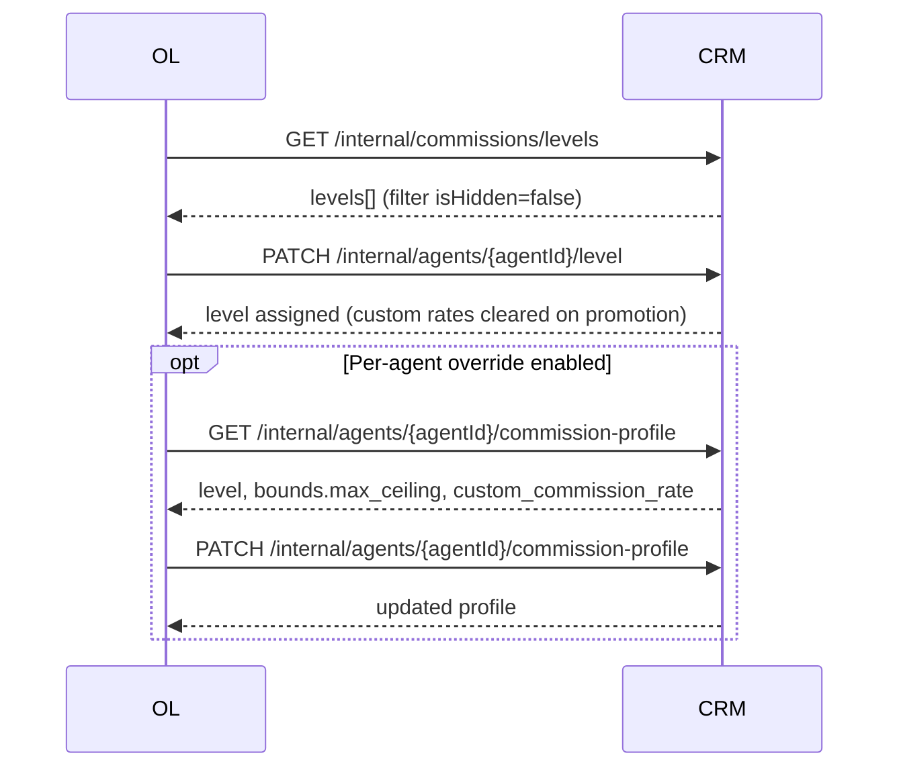

# Hibarr CRM — Internal Commission & Agent Level APIs (OL Integration)

System-to-system endpoints for OL to manage agent commission levels and per-agent commission overrides in Hibarr CRM.

**Base path:** `{CRM_BASE_URL}/api/v1`

Example: `https://crm.example.com/api/v1/internal/commissions/levels`

---

## Authentication

All endpoints below require the `api.token` middleware.

| Header          | Required    | Description                               |
| --------------- | ----------- | ----------------------------------------- |
| `X-API-TOKEN`   | Yes\*       | API token from the CRM `api_tokens` table |
| `Authorization` | Yes\*       | Alternative: `Bearer <token>`             |
| `X-COMPANY-ID`  | Yes\*\*     | Company context for the request           |
| `Content-Type`  | Yes (PATCH) | `application/json`                        |
| `Accept`        | Recommended | `application/json`                        |

\* Provide one of `X-API-TOKEN` or `Authorization: Bearer <token>`.

\*\* If omitted, the middleware may fall back to `api_tokens.company_id` when the token row has a company set. If the header company differs from the token’s company, the request is rejected with **401**.

### Auth errors (401)

```json
{ "message": "..." }
```

Returned when the token is missing, invalid, revoked, or company context cannot be resolved.

---

## Identifiers

| Parameter                | Meaning                                                 |
| ------------------------ | ------------------------------------------------------- |
| `{agentId}`              | `lead_agents.id` (CRM agent record), **not** `users.id` |
| `{levelId}` / `level_id` | `mlm_levels.id` for the target company                  |
| Company scope            | All data is scoped by `X-COMPANY-ID`                    |

---

## Feature flags

| Flag key                              | Env override (local/testing)                  | Affects                                                                    |
| ------------------------------------- | --------------------------------------------- | -------------------------------------------------------------------------- |
| `sales.per-agent-commission-override` | `FEATURE_SALES_PER_AGENT_COMMISSION_OVERRIDE` | Commission profile GET/PATCH — returns **404** when disabled               |
| `sales.bulk-agent-promotion`          | `FEATURE_SALES_BULK_AGENT_PROMOTION`          | Gates OL orchestration on the OL side; CRM level endpoints remain callable |

---

## Endpoints overview

| Method  | Path                                            | Purpose                                              |
| ------- | ----------------------------------------------- | ---------------------------------------------------- |
| `GET`   | `/internal/commissions/levels`                  | List all commission levels for a company             |
| `GET`   | `/internal/agents/{agentId}/commission-profile` | Read agent level, custom rate, bounds, audit history |
| `PATCH` | `/internal/agents/{agentId}/commission-profile` | Set or clear a unified custom commission rate        |
| `PATCH` | `/internal/agents/{agentId}/level`              | Assign a commission level to an agent                |

---

## 1. List commission levels

### `GET /api/v1/internal/commissions/levels`

Returns all MLM levels for the company, ordered by rank. Includes hidden levels (check `isHidden` before assignment).

#### Query parameters

None.

#### Success (200)

```json
{
    "status": "success",
    "data": [
        {
            "id": 1,
            "name": "Bronze",
            "slug": "bronze",
            "rank": 1,
            "commissionPercentage": 2.0,
            "directRate": 2.0,
            "overrideRate": 2.0,
            "isHidden": false
        },
        {
            "id": 2,
            "name": "Owner",
            "slug": "owner",
            "rank": 2,
            "commissionPercentage": 10.0,
            "directRate": 10.0,
            "overrideRate": 10.0,
            "isHidden": true
        }
    ]
}
```

#### Field notes

| Field                         | Description                                                         |
| ----------------------------- | ------------------------------------------------------------------- |
| `rank`                        | Ordering; higher rank = higher level                                |
| `commissionPercentage`        | Default level commission %                                          |
| `directRate` / `overrideRate` | Component rates; fall back to `commissionPercentage` when unset     |
| `isHidden`                    | Hidden levels must **not** be assigned via the level PATCH endpoint |

---

## 2. Get agent commission profile

### `GET /api/v1/internal/agents/{agentId}/commission-profile`

> **Requires** feature flag `sales.per-agent-commission-override`. Returns **404** when disabled.

#### Query parameters

| Param            | Default | Max   | Description         |
| ---------------- | ------- | ----- | ------------------- |
| `audit_per_page` | `15`    | `100` | Audit log page size |

#### Success (200)

```json
{
    "status": "success",
    "data": {
        "agent_id": 42,
        "level": {
            "id": 1,
            "name": "Bronze",
            "rank": 1,
            "default_commission_rate": 2.0
        },
        "custom_commission_rate": 3.0,
        "bounds": {
            "max_ceiling": 5.0,
            "is_highest_visible_level": false
        },
        "audit": {
            "current_page": 1,
            "data": [
                {
                    "id": 10,
                    "company_id": 1,
                    "agent_id": 42,
                    "changed_by_user_id": null,
                    "previous_direct_rate": null,
                    "new_direct_rate": "3.00",
                    "previous_override_rate": null,
                    "new_override_rate": "3.00",
                    "changed_at": "2026-06-18T12:00:00.000000Z",
                    "reason": "OL adjustment",
                    "changed_by_user": null
                }
            ],
            "per_page": 15,
            "total": 1
        }
    }
}
```

#### Field notes

| Field                             | Description                                                                                          |
| --------------------------------- | ---------------------------------------------------------------------------------------------------- |
| `custom_commission_rate`          | Unified override; `null` = using level default                                                       |
| `bounds.max_ceiling`              | Max allowed custom rate for this agent’s current level                                               |
| `bounds.is_highest_visible_level` | `true` when agent is on the highest visible level (ceiling uses company `max_commission_percentage`) |
| `audit`                           | Standard Laravel pagination object                                                                   |

#### Errors

| Status | When                                             |
| ------ | ------------------------------------------------ |
| `404`  | Feature flag off, or agent not found for company |

---

## 3. Update agent commission profile

### `PATCH /api/v1/internal/agents/{agentId}/commission-profile`

> **Requires** feature flag `sales.per-agent-commission-override`. Returns **404** when disabled.

Sets a single unified custom commission rate. Internally, CRM writes the same value to both `custom_direct_rate` and `custom_override_rate`.

#### Request body

```json
{
    "custom_commission_rate": 4.0,
    "reason": "OL adjustment",
    "changed_by_user_id": 123
}
```

| Field                    | Type           | Required                      | Rules                                                                       |
| ------------------------ | -------------- | ----------------------------- | --------------------------------------------------------------------------- |
| `custom_commission_rate` | number \| null | **Yes** (key must be present) | `0`–`100` at request validation; further bounded by agent level (see below) |
| `reason`                 | string         | No                            | Max 1000 chars; stored in audit log                                         |
| `changed_by_user_id`     | integer \| null | No                           | CRM `users.id` in the same company. Omitted or `null` = system/OL origin    |

**Clear override:** send `"custom_commission_rate": null`.

#### Success (200)

```json
{
    "status": "success",
    "message": "Commission profile updated successfully.",
    "data": {
        "agent_id": 42,
        "level": {
            "id": 1,
            "name": "Bronze",
            "rank": 1,
            "default_commission_rate": 2.0
        },
        "custom_commission_rate": 4.0,
        "bounds": { "max_ceiling": 5.0, "is_highest_visible_level": false },
        "audit": { "...": "paginated audit logs" }
    }
}
```

#### Commission rate bounds

The allowed max depends on the agent’s **current level**:

- **Not on highest visible level:** ceiling = next visible level’s rate (typically `directRate` / `overrideRate` of the next rank).
- **On highest visible level:** ceiling = company `max_commission_percentage` from MLM settings.

Example: Bronze (rank 1, 2%) with Silver (rank 2, 5%) above it → `max_ceiling` = `5.0`. A rate of `6.0` is rejected.

#### Error responses

**422 — bound violation**

```json
{
    "status": "fail",
    "message": "Commission rate validation failed.",
    "errors": {
        "custom_commission_rate": [
            "Commission rate must be between 0 and 5.00 (inclusive)."
        ]
    }
}
```

**422 — missing field** (Laravel validation or service-level)

```json
{
    "errors": {
        "custom_commission_rate": [
            "The custom commission rate field is required."
        ]
    }
}
```

| Status | When                                                        |
| ------ | ----------------------------------------------------------- |
**422 — invalid actor**

```json
{
    "message": "Request could not be validated",
    "error": {
        "message": "Request could not be validated",
        "code": 422,
        "details": {
            "changed_by_user_id": [
                "The selected changed by user id is invalid."
            ]
        }
    }
}
```

| Status | When                                                        |
| ------ | ----------------------------------------------------------- |
| `404`  | Feature flag off, or agent not found                        |
| `422`  | Rate out of bounds, missing `custom_commission_rate` key, or invalid `changed_by_user_id` |

#### Audit behavior

- Every rate change creates an immutable row in `agent_commission_rate_audit_logs`.
- When `changed_by_user_id` is sent and belongs to the company, it is stored on the audit row and returned as `changed_by_user` (`id`, `name`).
- When omitted or `null`, `changed_by_user_id` / `changed_by_user` stay `null` (system/OL origin).
- A user id that does not exist, or belongs to another company, is rejected with **422**.
- No-op updates (same rate) do not create a new audit entry.

---

## 4. Assign agent commission level

### `PATCH /api/v1/internal/agents/{agentId}/level`

Direct level assignment for OL bulk promotion. Does **not** run auto-evaluation / qualification checks.

#### Request body

```json
{
    "levelId": 123,
    "changed_by_user_id": 123
}
```

`level_id` is also accepted for backward compatibility. One of `levelId` or `level_id` is required.

| Field                | Type            | Required | Rules                                                                                    |
| -------------------- | --------------- | -------- | ---------------------------------------------------------------------------------------- |
| `levelId` / `level_id` | integer       | **Yes** (one of) | Target `mlm_levels.id` for the company                                              |
| `changed_by_user_id` | integer \| null | No       | CRM `users.id` in the same company. Omitted or `null` = system/OL origin (`assigned_by`) |

#### Success (200)

```json
{
    "status": "success",
    "message": "Agent level updated successfully.",
    "data": {
        "agentId": 42,
        "levelId": 123,
        "levelName": "Silver",
        "assignedAt": "2026-06-18T12:00:00+00:00"
    }
}
```

#### Error responses

| Status | `error` code      | When                                                                |
| ------ | ----------------- | ------------------------------------------------------------------- |
| `401`  | —                 | Missing/invalid token                                               |
| `404`  | `AGENT_NOT_FOUND` | Agent does not exist for company                                    |
| `404`  | `LEVEL_NOT_FOUND` | Level does not exist for company (includes cross-company level IDs) |
| `422`  | `LEVEL_HIDDEN`    | Target level has `is_hidden = true`                                 |
| `422`  | —                 | Missing `levelId` / `level_id`                                      |

Examples:

```json
{ "error": "AGENT_NOT_FOUND", "message": "Agent not found." }
```

```json
{ "error": "LEVEL_NOT_FOUND", "message": "Commission level not found." }
```

```json
{
    "error": "LEVEL_HIDDEN",
    "message": "Hidden levels cannot be assigned through normal promotion flows."
}
```

```json
{
    "status": "fail",
    "message": "The levelId field is required.",
    "errors": { "levelId": ["The levelId field is required."] }
}
```

#### Behavior notes

- Creates a new `agent_level_history` row with `system_assigned = false`.
- `changed_by_user_id` is stored as `assigned_by` on that history row (and on the custom-rate-cleared audit entry when a promotion clears overrides).
- Does **not** trigger `LevelService::evaluate()` (no auto-promotion side effects from this call).
- **Promotion side effect:** when assigning a **higher rank** and `sales.per-agent-commission-override` is enabled, any existing `custom_direct_rate` / `custom_override_rate` are cleared automatically, with an audit log reason `"Custom rates cleared on level promotion"`.
- Demotion or same-rank assignment does **not** clear custom rates.
- Future deal-won events may still trigger normal CRM auto-promotion for higher visible levels.

---

## Recommended OL integration flow



### Typical sequence

1. **Discover levels** — `GET /internal/commissions/levels`; cache visible levels (`isHidden === false`).
2. **Promote agent** — `PATCH /internal/agents/{agentId}/level` with target `levelId`.
3. **Optional override** (if feature flag on):
    - `GET .../commission-profile` to read `bounds.max_ceiling`.
    - `PATCH .../commission-profile` with rate ≤ `max_ceiling`.
4. **Handle errors** — treat `LEVEL_HIDDEN`, `AGENT_NOT_FOUND`, and bound violations as business errors, not retries.

---

## Example requests (cURL)

### List levels

```bash
curl -s -X GET "{CRM_BASE_URL}/api/v1/internal/commissions/levels" \
  -H "X-API-TOKEN: <token>" \
  -H "X-COMPANY-ID: 1" \
  -H "Accept: application/json"
```

### Assign level

```bash
curl -s -X PATCH "{CRM_BASE_URL}/api/v1/internal/agents/42/level" \
  -H "X-API-TOKEN: <token>" \
  -H "X-COMPANY-ID: 1" \
  -H "Content-Type: application/json" \
  -d '{"levelId": 3, "changed_by_user_id": 123}'
```

### Get commission profile

```bash
curl -s -X GET "{CRM_BASE_URL}/api/v1/internal/agents/42/commission-profile?audit_per_page=10" \
  -H "X-API-TOKEN: <token>" \
  -H "X-COMPANY-ID: 1" \
  -H "Accept: application/json"
```

### Set custom commission rate

```bash
curl -s -X PATCH "{CRM_BASE_URL}/api/v1/internal/agents/42/commission-profile" \
  -H "X-API-TOKEN: <token>" \
  -H "X-COMPANY-ID: 1" \
  -H "Content-Type: application/json" \
  -d '{"custom_commission_rate": 4.5, "reason": "OL bulk adjustment", "changed_by_user_id": 123}'
```

### Clear custom commission rate

```bash
curl -s -X PATCH "{CRM_BASE_URL}/api/v1/internal/agents/42/commission-profile" \
  -H "X-API-TOKEN: <token>" \
  -H "X-COMPANY-ID: 1" \
  -H "Content-Type: application/json" \
  -d '{"custom_commission_rate": null, "reason": "Reverting to level default"}'
```

---

## Error handling checklist

| Scenario                                      | HTTP                    | Action                                           |
| --------------------------------------------- | ----------------------- | ------------------------------------------------ |
| Invalid/missing token                         | `401`                   | Fix credentials; do not retry blindly            |
| Commission profile flag off                   | `404`                   | Skip override APIs; level APIs still work        |
| Agent not in company                          | `404`                   | Validate `agentId` mapping                       |
| Level not in company                          | `404` `LEVEL_NOT_FOUND` | Refresh levels cache                             |
| Hidden level assignment                       | `422` `LEVEL_HIDDEN`    | Choose a visible level                           |
| Rate above ceiling                            | `422`                   | Re-read profile bounds and retry with valid rate |
| Missing `levelId`                             | `422`                   | Fix request payload                              |
| Missing `custom_commission_rate` key on PATCH | `422`                   | Include key (use `null` to clear)                |
| `changed_by_user_id` unknown / other company  | `422`                   | Send a CRM `users.id` for this company, or omit  |
